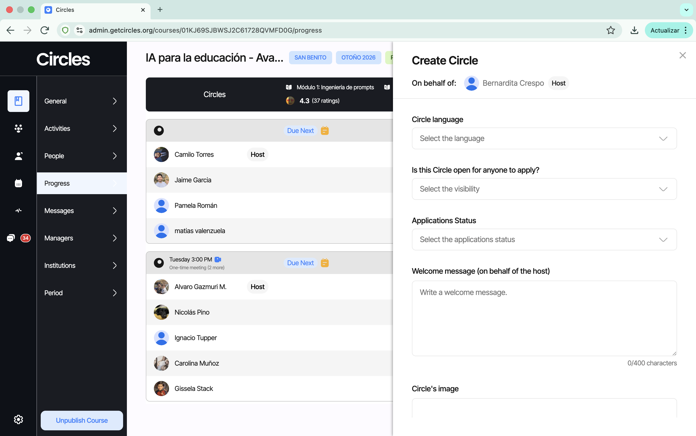
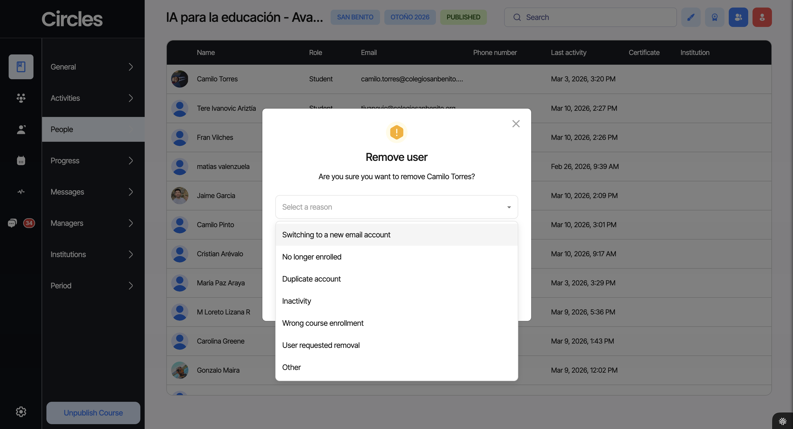

# MANUAL DE SOPORTE

**Circles Learning**

Guía operativa para el equipo de soporte

Versión 2.2 — Marzo 2026 | Equipo de Soporte — Circles Learning

---

## Cómo usar este manual

Este manual es la guía de referencia para todo el equipo de soporte de Circles Learning. Contiene los procesos, herramientas, plantillas y criterios necesarios para brindar una experiencia de soporte consistente y de calidad a nuestros usuarios.

### A quién va dirigido

- Asistentes de soporte (rol principal de atención al usuario)
- Coordinadores de soporte (supervisión, estrategia y escalamiento)
- Nuevos integrantes del equipo (sección de onboarding al final)

### Cómo está organizado

1. **Herramientas del equipo:** las plataformas y sistemas que usamos diariamente.
2. **Estructura y responsabilidades:** roles, tareas diarias y tareas por etapa del curso.
3. **Plataforma Admin Circles:** guía detallada del uso de la plataforma administrativa, incluyendo creación de círculos y carga manual de entregas.
4. **Help Desk:** sistema de tickets y chat de soporte.
5. **Registro de datos:** cómo gestionar la base de datos, las pestañas de seguimiento y las bajas.
6. **Problemas, preguntas y respuestas:** procedimientos ante situaciones comunes y FAQ.
7. **Plantillas de mensajes:** mensajes estandarizados para distintos canales.
8. **Para Coordinadores:** responsabilidades y procesos del rol de coordinación.
9. **Tiempos de respuesta (SLAs):** tiempos esperados para cada tipo de acción.
10. **Protocolo de escalamiento:** cuándo y cómo escalar casos.
11. **Onboarding:** guía de incorporación para nuevos miembros.

### Tono y filosofía de soporte

En Circles, el soporte no es solo resolver problemas; es acompañar a los usuarios en su experiencia de aprendizaje. Nuestros principios rectores son:

- Maximizar la retención de estudiantes.
- Mantener a la mayor cantidad de estudiantes satisfechos.
- Priorizar siempre la solución sobre el protocolo rígido.
- Comunicar con empatía, paciencia y claridad, especialmente con usuarios menos familiarizados con la tecnología.

---

## 1. Herramientas del equipo

El equipo de soporte utiliza las siguientes herramientas en su trabajo diario. Familiarízate con cada una antes de comenzar a operar.

| Herramienta | Uso principal | Acceso |
|---|---|---|
| **Admin Circles** | Gestión de cursos, usuarios, mensajes y progreso | admin.getcircles.org |
| **Help Desk** | Sistema de tickets y chat de soporte con chatbot | helpdesk.getcircles.org |
| **WhatsApp** | Comunicación directa con usuarios (individual y grupal) | Teléfono del equipo |
| **Gmail** | Correos formales: credenciales, bajas, notificaciones | Cuenta del equipo |
| **Base de Datos** | Registro y seguimiento de inscritos, bajas y avance | Hoja de cálculo compartida |
| **Torpedo Soporte** | Fechas y links de tutorías | Documento compartido |

> **TIP:** Ten abiertos en pestañas simultáneas: el Sistema de Tickets, el Chat de Soporte, la plataforma Admin y la Base de Datos. Esto agiliza tu flujo de trabajo diario.

---

## 2. Estructura y responsabilidades

### 2.1 Responsabilidades diarias del Asistente

#### En Help Desk

- Contestar los chats escalados a un agente humano en el Help Desk.
- Registrar casos complicados en el Sistema de Tickets (ver sección de Help Desk para detalles).
- Actualizar y resolver tickets conforme se vayan resolviendo los casos.

#### En Admin

- Registro y actualización de datos de usuarios.

#### Correo electrónico

- Responder consultas de usuarios por correo según las plantillas estandarizadas.

### 2.2 Responsabilidades por etapa del curso

#### Primeros Pasos

Acompañar a los usuarios en su primer ingreso a la plataforma: verificar credenciales, resolver dudas de acceso, y asegurar que los datos del usuario estén correctamente registrados en la base de datos.

#### Match (formación de círculos)

Apoyar a los usuarios en la búsqueda y formación de círculos: verificar disponibilidad horaria, facilitar el contacto entre usuarios sin grupo, y escalar a Coordinación cuando un usuario no logra integrarse.

#### Desarrollo del curso

Monitorear el avance de los círculos, dar seguimiento a usuarios inactivos, verificar entregas de actividades, y resolver problemas operativos que surjan durante los módulos.

---

## 3. Plataforma Admin Circles

**Link:** https://admin.getcircles.org/auth

### 3.1 Mensajes (Messages)

La pestaña de Mensajes muestra todos los chats en los que has participado. Los docentes no pueden iniciar el chat contigo; debes entrar tú e iniciar la conversación. Es la primera opción de comunicación, aunque si el usuario no ve los mensajes, se recomienda usar otro canal (WhatsApp o correo).

Al entrar a un chat, se notifica a todos los participantes. Bajo el nombre del usuario se muestra la última actividad (minutos, horas, días o meses). También se puede ver la foto de perfil, nombre, curso e institución del docente.

Funciones disponibles en el chat: envío de archivos, encuestas, emojis, mensajes de texto y audio. También hay un ícono de llamada, útil para comunicación más detallada o con usuarios mayores.

### 3.2 Cursos (Courses)

Al entrar a un curso, se presentan tres pestañas: People, Progress y Messages. Cada una tiene funciones específicas que se detallan a continuación.

#### People Tab

Funciona como una base de datos de los docentes del curso. Muestra: nombre, rol, correo, teléfono, última actividad, estado del certificado, institución y TAG. Incluye un buscador por nombre o correo.

**Agregar un usuario:** Botón "Add people" > marcar siempre como "Student" > ingresar correo > "Invite".

**Remover un usuario:** Pasar el mouse sobre la imagen del docente para ver el menú con las opciones: Profile, Message y Remove from course.

> **NOTA:** Al remover a alguien, siempre hay que consultar y registrar la razón de la baja. Esto ayuda a identificar patrones.

#### Progress Tab

La pestaña más utilizada. Permite monitorear el avance del curso, los participantes y los círculos. Incluye filtros, buscador por nombre, y el botón "Not in a Circle" para ver personas sin grupo.

**Módulos:** Se visualizan en una barra horizontal. Cada módulo muestra el rating del exit ticket (satisfacción de los docentes) y al hacer clic se despliegan los contenidos: objetivos, actividades, entregable, cierre y contenido adicional.

**Círculos:** Se muestra el día y hora de la reunión, si es semanal, y quién es el Host (encargado de subir actividades y programar reuniones). Al hacer clic en el ícono se ve: estado, creador, descripción, idioma, reuniones, miembros y asistente a cargo.

**Progreso/Actividades:** Las entregas pueden ser grupales (las sube el Host) o individuales (cada participante). Si no se envía a tiempo, aparece "Pending". Una actividad enviada se marca con un ícono amarillo.

#### Messages Tab

Pestaña de mensajes dentro del contexto del curso. Se actualiza automáticamente al unirse a conversaciones desde People o desde la pestaña general de Messages.

### 3.3 Crear un círculo desde Admin

En algunos casos, un usuario necesita apoyo externo para formar un círculo — por ejemplo, si no logra integrarse durante el periodo de Match, si su círculo se disolvió, o si se incorpora tarde al curso. En estas situaciones, el equipo de soporte puede crear un círculo directamente desde la plataforma Admin.

#### Cuándo crear un círculo desde Admin

- El usuario no pudo hacer Match por su cuenta y ya se agotó el periodo de formación libre.
- Un círculo perdió miembros y es necesario rearmar uno nuevo.
- Coordinación solicita la creación de un círculo para reubicar usuarios.

#### Pasos para crear un círculo

1. Dentro del curso en Admin, ir a la pestaña **Progress**.
2. Seleccionar el botón **"Not in a Circle"** (arriba a la derecha). Se desplegará la lista de todas las personas que aún no tienen círculo.

> **IMPORTANTE:** La opción de crear círculo solo está disponible para usuarios que ya ingresaron a la plataforma (estado **"New User"**). No es posible crear un círculo para usuarios en estado "Prospect" (que aún no han ingresado).

3. Posicionar el mouse sobre la foto de perfil del usuario que será anfitrión/a. Aparecerán cuatro opciones.
4. Seleccionar la segunda opción: **"Make Circle Host"**. Esto creará un círculo nuevo con esa persona como anfitrión/a.
5. Completar los campos del nuevo círculo:
   - **Circle Language:** idioma del círculo.
   - **Is this circle open for anyone to apply:** si el círculo estará abierto a postulaciones.
   - **Application status:** estado de las postulaciones.
   - **Mensaje de bienvenida:** texto que verán los miembros al unirse.
   - **Imagen del círculo:** foto o imagen representativa.
6. **(Opcional) Agregar miembros de inmediato:** se desplegará una lista con todos los integrantes del curso que sean "New Users" para agregarlos directamente al crear el círculo.
7. Seleccionar el botón **"Create Circle"** al final para confirmar la creación.

> **NOTA:** La creación de círculos desde Admin es una acción de soporte. Siempre debe estar respaldada por una solicitud de Coordinación o por una situación documentada que lo justifique.

### 3.4 Subir entregas manualmente

Cuando un círculo o un usuario individual no puede subir una entrega por la vía habitual (problemas técnicos, acceso limitado, etc.), el equipo de soporte puede cargar la entrega de forma manual desde la plataforma Admin.

#### Cuándo subir una entrega manualmente

- El usuario reporta un error técnico que le impide subir la entrega.
- El Host de un círculo no está disponible y el grupo necesita que se registre una entrega grupal.
- Coordinación solicita la carga manual de una entrega como excepción.

#### Subir entrega por un círculo

<!-- TODO: Completar con los pasos específicos para entrega grupal -->

#### Subir entrega por un usuario individual

<!-- TODO: Completar con los pasos específicos para entrega individual -->

> **NOTA:** Toda entrega subida manualmente debe quedar documentada (quién la subió, por qué motivo y cuándo) para mantener la trazabilidad del proceso.

---

## 4. Help Desk

**Link:** https://helpdesk.getcircles.org/

El Help Desk tiene dos elementos principales: el Sistema de Tickets y el Chat de Soporte.

### 4.1 Sistema de Tickets

El sistema de tickets permite gestionar las solicitudes e incidentes de los usuarios de forma organizada. Los tickets son la **memoria compartida del equipo** y el mecanismo principal de coordinación entre los SA que atienden el chat en distintos turnos.

#### Regla de tickets obligatorios

**Cada conversación en el Help Desk debe tener un ticket asociado, sin excepciones.** Cuando un chat nuevo llegue (escalado o tomado manualmente), se debe crear un ticket en el sistema de tickets.

La única excepción son consultas no válidas: mensajes donde el usuario no hace una consulta efectiva (ej. "hola" sin seguimiento posterior, un punto, caracteres sueltos sin respuesta).

**Por qué es obligatorio:** Como distintos SA atienden el chat en distintos turnos, y las consultas pueden ser de cualquier convocatoria, el ticket es la única forma de saber qué le pasó a un usuario, qué se le dijo y si su caso se resolvió. Sin tickets, un SA puede contactar a alguien sin saber que otro ya lo atendió, generando información contradictoria o desactualizada.

#### Qué incluir en cada ticket

- **Correo del usuario** (cuando se conozca) — permite buscar tickets existentes antes de contactar a alguien
- **Descripción del problema**
- **Acciones tomadas** y por quién
- **Estado**: si fue resuelto o queda pendiente

Usar la sección de notas del ticket para agregar actualizaciones al historial.

#### Antes de contactar a un usuario

Antes de escribirle a un usuario por cualquier canal, revisar si ya existe un ticket a su nombre en el sistema. Leer el historial y las notas para ponerse al día con el caso.

### 4.2 Chat de Soporte

En esta sección se encuentran todas las conversaciones de los usuarios con el Chatbot de Circles (+1 (650) 600-6132). Los usuarios acceden desde la app móvil o web. Las conversaciones se dividen en:

- **All Chats:** todas las conversaciones.
- **Human Support:** chats escalados a un agente humano (etiqueta "Escalated").
- **AI Support:** conversaciones gestionadas por el chatbot.

> **NOTA:** El Chat de Soporte no tiene notificaciones. Debes mantenerlo abierto en una pestaña para detectar nuevos mensajes.

#### Sistema de turnos

Las consultas del Help Desk llegan de manera anónima, de cualquier convocatoria. No es posible filtrar ni asignar chats a un SA específico; a medida que el usuario entrega sus datos, se puede ir rellenando su información. Para asegurar cobertura continua sin que dos SA se pisen los talones, el chat funciona con un sistema de turnos:

- **Horario de cobertura:** 9:00 a 21:00.
- **Una sola persona por turno** — se asignan turnos por hora a cada SA según sus horarios disponibles.
- **Durante tu turno, contestas cualquier consulta que llegue**, sin importar si es de tu convocatoria o no. El chat es transversal a todas las convocatorias.
- **Lunes a viernes:** cobertura obligatoria, sin brechas. Si no puedes cubrir tu turno, avisa al SA Senior con anticipación para que busque reemplazo.
- **Sábado y domingo:** los turnos son voluntarios. Está bien si hay brechas, siempre y cuando no superen las 3 horas.

#### Regla de handoff (traspaso entre SA)

Si durante tu turno atiendes un caso que es de otra convocatoria y no logras resolverlo en el momento:

1. Deja el ticket con notas claras de lo que hiciste y lo que falta por resolver.
2. Avisa al SA asignado a esa convocatoria para que haga el seguimiento posterior.

**El turno del chat es para dar la primera respuesta. El seguimiento profundo lo hace el SA asignado al curso.** Esto asegura que el usuario recibe atención inmediata, pero que el caso queda en manos de quien conoce mejor esa convocatoria.

#### Responder chats escalados

Selecciona la pestaña "Human Support" para ver todos los chats que requieren atención humana.

#### Tomar conversaciones donde la IA no ayuda

Si detectas que el chatbot no está resolviendo la consulta del usuario, toma la conversación manualmente.

#### Resolver conversaciones

Una vez solucionado el problema, marca el chat como "resuelto" con el botón "Resolve" en la esquina superior derecha.

#### Conversaciones inactivas

Si tardaste más de 12 horas en contestar, el chat pasa a "inactivo". En este estado solo puedes enviar una plantilla (template) para reactivar la conversación.

#### Editar información del usuario

El chatbot recopila nombre, teléfono, correo y cursos durante la conversación. Si la conversación escala a un agente humano, debes ingresar esta información manualmente con la opción "Editar" en el recuadro de datos del chat.

---

## 5. Registro de datos

La base de datos es una hoja de cálculo compartida que centraliza la información de todos los inscritos. Sus pestañas principales son:

### 5.1 Consolidado

Pestaña de información completa y actualizable con las columnas: Course ID, Nombre del curso, RUT, Correo inscrito, Teléfono, Sede y Cargo. Aquí se concentra la información resumida por docente.

> **NOTA:** Esta pestaña debe mantenerse actualizada. Siempre notifica a un coordinador cuando hagas modificaciones importantes (como eliminar filas). Usa Ctrl+F para buscar docentes, ya que algunos están en más de un curso.

### 5.2 Pestañas por curso

Cada curso tiene su propia pestaña de seguimiento con las columnas: Stage, Email, Name, Last Name, Host, Reunión, Módulos (1-4), Comentarios Asistente y Comentarios Coordinador.

Los stages posibles son: "Meeting Scheduled" (en un grupo con reunión agendada), "Circle member" (en un grupo sin reunión agendada), "New user" (ingreso reciente) y "Prospect" (aún no entra a la plataforma).

### 5.3 Bajas

> **NOTA:** Solo se debe dar de baja a inscritos que solicitan la baja explícitamente.

Para dar de baja: cortar la fila completa del Consolidado y pegarla en la pestaña de Bajas. Esta pestaña incluye columnas adicionales: Motivo, Fecha de la baja, Quién lo dio de baja y ¿Hizo Match?.

Siempre pregunta al docente el motivo de la baja. Si no lo indica, el asistente puede deducirlo, señalando que no se dio un motivo explícito. Registrar si hizo match es prioritario para identificar si la falta de grupo fue determinante.

#### Qué casos contabilizar como bajas (Count as Dropouts)

No toda salida de un usuario se registra de la misma forma. A continuación se definen los criterios para determinar qué casos deben contabilizarse como baja formal en la pestaña de Bajas y en los reportes de retención.

**Casos que SÍ cuentan como baja:**

| Caso | Descripción | Acción |
|---|---|---|
| **Baja explícita** | El usuario solicita directamente ser dado de baja del curso. | Registrar en Bajas con el motivo indicado por el usuario. |
| **Desvinculación laboral** | El usuario ya no trabaja en la institución asociada al curso. | Registrar en Bajas con motivo "Desvinculación laboral". Informar a Coordinación. |
| **Inactividad prolongada sin respuesta** | El usuario dejó de participar y no responde a ningún intento de contacto (plataforma, correo, llamada y WhatsApp) durante 3 semanas o más. | Registrar en Bajas con motivo "Inactividad / sin respuesta". Requiere aprobación de Coordinación antes de ejecutar la baja. |
| **Incompatibilidad horaria sin solución** | El usuario no puede reunirse con ningún círculo disponible y no existe posibilidad de reubicación. | Registrar en Bajas con motivo "Sin compatibilidad horaria". Solo después de que Coordinación haya agotado las opciones. |
| **Razones personales o de salud** | El usuario comunica que no puede continuar por motivos personales, familiares o de salud. | Registrar en Bajas con el motivo indicado. Responder con empatía e invitar a sumarse en una futura oportunidad. |
| **Problemas técnicos irresolubles** | El usuario no puede acceder a la plataforma y las alternativas ofrecidas (app web, cambio de correo) no funcionan. | Registrar en Bajas con motivo "Problemas técnicos". Solo después de agotar todas las soluciones con apoyo de Coordinación. |

**Casos que NO cuentan como baja:**

| Caso | Descripción | Qué hacer en su lugar |
|---|---|---|
| **Cambio de círculo** | El usuario sale de un círculo para unirse a otro. | No registrar en Bajas. Actualizar la pestaña del curso con el nuevo círculo. |
| **Salida accidental de un círculo** | El usuario se salió por error y necesita ser reintegrado. | No registrar en Bajas. Escalar a Coordinación para reintegro. |
| **Inactividad temporal (< 3 semanas)** | El usuario dejó de participar recientemente pero aún no se han agotado los intentos de contacto. | No registrar en Bajas. Seguir el protocolo de contacto: plataforma → correo → llamada → WhatsApp. |
| **Cambio de correo** | El usuario necesita ingresar con un correo diferente. | No registrar en Bajas. Escalar a Coordinación para gestionar el cambio de cuenta. |
| **Pausa comunicada** | El usuario avisa que estará ausente temporalmente pero planea continuar. | No registrar en Bajas. Documentar en Comentarios del Asistente y dar seguimiento en la fecha indicada. |

#### Cómo dar de baja a usuarios

Cuando un usuario solicita ser dado de baja del curso, el asistente debe seguir estos pasos:

1. **Confirmar la intención:** Verificar que el usuario realmente desea darse de baja y que no es un error o un momento de frustración. Si el usuario eliminó su cuenta, contactarlo para confirmar que fue intencional.
2. **Preguntar el motivo:** Siempre preguntar al usuario por qué desea darse de baja. Registrar el motivo textual en el campo de "Motivo" en la pestaña de Bajas y en el Consolidado.
3. **Clarificar motivos ambiguos:** Algunos motivos requieren mayor detalle para poder clasificarlos correctamente en los reportes. Ver la tabla a continuación.
4. **Registrar si hizo Match:** Verificar en Admin si el usuario hizo Match (columna "Did User Match"). Este dato es obligatorio.
5. **Ejecutar la baja:** Remover al usuario del curso en Admin (ver sección 3.2), cortar la fila del Consolidado y pegarla en la pestaña de Bajas con todos los campos completos.

**Motivos que requieren clarificación antes de registrar la baja:**

| Motivo reportado por el usuario | Qué clarificar | Por qué importa |
|---|---|---|
| **"Incompatibilidad de horarios"** o **"problemas de horario"** | Preguntar y registrar explícitamente si se trata de: (a) incompatibilidad de horarios **entre los miembros del círculo** para coordinar reuniones, o (b) un cambio en el **horario laboral del usuario** que le impide seguir participando. | La causa (a) es responsabilidad de Circles y se contabiliza como baja en reportes. La causa (b) es externa y no se contabiliza. Registrar la clarificación en el campo "Motivo" del Consolidado y de la pestaña de Bajas. |
| **"Mucho trabajo"** o **"no tengo tiempo"** | Preguntar si se refiere a carga laboral de su trabajo o a la carga del curso de Circles. | Aunque ambas se registran como baja, la distinción ayuda a identificar patrones en los reportes. |

**Criterios importantes para la decisión:**

1. **Siempre confirmar con Coordinación** antes de ejecutar una baja que no sea por solicitud explícita del usuario. Las bajas por inactividad, incompatibilidad o razones técnicas requieren aprobación.
2. **Documentar los intentos de contacto** con fechas y canales utilizados. Esto es evidencia necesaria para justificar una baja por inactividad.
3. **Registrar si hizo Match** es obligatorio en todos los casos de baja. Este dato alimenta los reportes de retención y ayuda a identificar si la formación de círculos es un factor crítico en la deserción.
4. **No apresurarse.** Si hay duda sobre si un caso es baja definitiva o temporal, esperar y consultar con Coordinación. Es más fácil dar de baja después que reintegrar a alguien.

#### Registro de bajas en Admin Circles

Al remover a un usuario desde la pestaña **People** en Admin Circles, la plataforma despliega un diálogo de confirmación que pregunta "Are you sure you want to remove [nombre]?" y solicita seleccionar un motivo obligatorio. Las opciones disponibles son:

| Opción en Admin | Descripción | Cuándo usarla |
|---|---|---|
| **Switching to a new email account** | El usuario está cambiando de cuenta porque desea o necesita utilizar otro correo para ingresar a su cuenta Circles. | Cuando el usuario solicita un cambio de correo electrónico. No es una baja real, sino un paso previo para recrear la cuenta con el nuevo correo. |
| **No longer enrolled** | El usuario ya no trabaja para la institución, o la institución solicitó sacarlo del curso por motivos varios. | Cuando el cliente (institución) pide que el usuario sea removido del curso. La decisión viene de la contraparte, no del usuario. |
| **Duplicate account** | Se crearon dos cuentas para el mismo usuario por error y se debe eliminar la duplicada. | Cuando se detecta que un usuario aparece dos veces en el curso. Eliminar solo la cuenta duplicada, conservando la que tiene actividad o progreso. |
| **Inactivity** | El usuario nunca ingresó a la aplicación y el curso ya comenzó. | Cuando un usuario registrado no ha iniciado sesión en ningún momento desde el inicio del curso. |
| **Wrong course enrollment** | Hubo un error de inscripción: el usuario se inscribió en el curso equivocado, o un miembro del equipo de Circles lo inscribió en el curso incorrecto. | Cuando se identifica que el usuario no corresponde al curso en el que aparece, ya sea por error propio o del equipo. |
| **User requested removal** | El usuario solicita directamente ser dado de baja del curso por motivos varios. | Cuando el usuario comunica explícitamente que desea retirarse del curso. Siempre preguntar y registrar el motivo (ver procedimiento de bajas más arriba). |
| **Other** | La baja no entra en ninguna de las categorías anteriores. | Para situaciones excepcionales no contempladas en las opciones anteriores. |

> **TIP:** Ante la duda sobre qué tipo de baja seleccionar para un usuario, consulta al coordinador de operaciones antes de ejecutar la remoción.

### 5.4 Otras pestañas

- **Calendario:** fechas clave del programa.
- **Historial de inscritos:** registro histórico.
- **Consolidado por estudiante:** vista alternativa de datos.

---

## 6. Problemas, preguntas y respuestas

### 6.1 Principios rectores

1. Maximizar retención.
2. Mantener a la mayor cantidad de estudiantes satisfechos.
3. Priorizar la solución.

Ante cualquier situación, recuerda el ejemplo de María: una docente de 68 años que necesita ayuda con Google Meet. La respuesta ideal es empática, ofrece llamada telefónica, pregunta por el dispositivo antes de dar instrucciones, divide los pasos en porciones pequeñas, y propone una prueba antes de la sesión real.

### 6.2 Problemas y sus procedimientos

#### Un usuario tiene problemas para acceder a su correo institucional

Informar a Coordinación de Soporte para gestionar la creación de una nueva cuenta con un correo diferente.

#### La App le pide un código numérico para iniciar sesión

La app de Circles no solicita códigos numéricos. Verificar que el usuario descargó la aplicación correcta desde www.getcircles.org/download.

#### Un usuario no ha recibido el correo con sus credenciales

1. Revisar bandeja de SPAM, notificaciones y promociones.
2. Para cuentas Microsoft Outlook, buscar el correo de cuarentena.
3. Si ya tenía cuenta previa, indicar que restablezca su contraseña.

#### Un usuario de convocatorias pasadas no puede recuperar su contraseña ("incorrect email or password")

Cuando un usuario que ya tenía cuenta de convocatorias anteriores intenta recuperar su contraseña y le aparece el mensaje "incorrect email or password", significa que su correo ya no está asociado como estudiante activo en el curso actual. Para verificar si se trata de un usuario de una convocatoria pasada, pueden buscarlo en Admin Circles: tendrá un "last activity" de varias semanas o meses de antigüedad.

**Solución:** Volver a agregar el correo del usuario al curso como estudiante desde la pestaña People en Admin Circles (botón "Add people" > "Student" > ingresar correo > "Invite"). Una vez agregado, el usuario podrá restablecer su contraseña con normalidad.

> **⚠️ ADVERTENCIA IMPORTANTE:** Bajo **ninguna** circunstancia se debe eliminar al usuario del curso para intentar solucionar este problema. Eliminar al usuario puede borrar sus cuentas de forma definitiva, lo cual es irreversible y extremadamente peligroso.

#### Un usuario no puede descargar la App Circles

Verificar si: a) no ha iniciado sesión en Play Store/App Store, o b) tiene un dispositivo Huawei (incompatible). Alternativa: usar la app web en student.getcircles.org.

#### Un usuario insiste en no querer usar la aplicación móvil

Informar las ventajas de la app móvil (chat, notificaciones, acceso en cualquier lugar), pero ofrecer la alternativa web: student.getcircles.org.

#### Un usuario insiste en querer realizar el curso individualmente

No es posible. La metodología Circles es colaborativa. Informar a Coordinación de Soporte para evaluar el caso y lograr que se una a un círculo.

#### Un anfitrión consulta si puede aceptar más integrantes

En semana de Match, las postulaciones deben aceptarse a la brevedad. Después, evaluar con el resto de los miembros para asegurar participación equitativa.

#### Un usuario aún no encuentra un círculo

Contactar de inmediato al usuario vía plataforma. Verificar disponibilidad horaria. Si no responde: escalar a correo, luego llamada y WhatsApp.

#### Un usuario ya no tiene disponibilidad horaria para su círculo

Revisar disponibilidad para reubicar en otro círculo compatible. Contactar al host del nuevo círculo. Si no hay opciones, informar a Coordinación.

#### Un círculo no tiene horarios en común

Si está en periodo de Match: los usuarios pueden salir y buscar otro círculo. Si ya terminó Match: escalar a Coordinación para reubicar integrantes.

#### Integrantes no asisten a la reunión grupal

Contactar a cada ausente de inmediato. Avisar al anfitrión. Enfatizar la importancia de asistir y avisar cuando no puedan.

#### Un usuario es plantado por sus compañeros

Contactar a los demás integrantes para conocer los motivos. Facilitar la comunicación para reagendar la reunión.

#### Un miembro ghostea a su grupo

Reportar a Coordinación. Intentar contacto en este orden: mensaje en plataforma, correo, llamada, WhatsApp. Si sigue inubicable, reportar nuevamente. Indicar al Host que lo desmarque como colaborador en entregas.

#### Un usuario se salió de su círculo accidentalmente

Reportar de inmediato a Coordinación para gestionar el reingreso.

#### Un usuario o grupo no quiere subir foto al Padlet

Explicar que la foto grupal es registro de asistencia (requisito de aprobación) y forma de generar comunidad.

#### Un usuario quiere editar una entrega en revisión

No es posible cancelar una entrega en revisión. El asistente debe informar a Coordinación para evaluar y solucionar la situación.

#### Un círculo no alcanzó a terminar el módulo

Pueden extender la reunión en curso o agendar una nueva durante la semana, ajustada a la disponibilidad de todos.

#### Un círculo desea cambiar al anfitrión

Contactar al anfitrión actual. Si no responde, pedir a los integrantes que elijan un nuevo anfitrión. Informar a Coordinación.

#### Un entregable fue rechazado

El Host (grupal) o usuario (individual) debe reenviar la entrega corregida: seleccionar círculo > entrega rechazada > "Reenviar" > subir corrección > "Enviar actividad".

#### Un usuario quiere reportar un error técnico

Tomar nota del reporte y comunicarlo a Coordinación para evaluación y gestión.

#### Un usuario quiere reportar acoso/discriminación

Circles no tolera discriminación ni acoso. El usuario debe hablar con un agente humano. Informar a Coordinación de inmediato.

#### Un usuario quiere enviar un reclamo/sugerencia/felicitación

Dirigir al formulario: https://forms.gle/iruZRk6CnR4ju21EA. Si es urgente, atender directamente e informar a Coordinación.

### 6.3 Preguntas frecuentes

**¿Puedo seguir haciendo el curso si ya no trabajo en la institución?**
No. Informar a Coordinación para gestionar la baja.

**¿Todos deben responder la encuesta de cierre?**
Sí, todos los miembros del círculo deben responderla.

**¿Qué pasa si no completo el curso a tiempo?**
No podrá obtener el certificado. Si necesita extensión, debe escribir a catalina@getcircles.org explicando su situación.

**¿Hasta cuándo tendré acceso a los contenidos?**
Indefinidamente, siempre que esté activo en un círculo. Si se da de baja o no tiene círculo, pierde acceso.

**¿Cuándo me darán mi certificado?**
La fecha se determina cuando todos finalizan el curso. Consultar a Coordinación para fechas precisas.

**¿Cuándo me retroalimentarán mi entrega?**
Dentro de 7 días después de ser subida. Si no recibe retroalimentación, el asistente reporta a Coordinación.

**¿Cuáles son las fechas/horarios de las tutorías?**
Consultar con Coordinación de Soporte. Las fechas y links están en el Torpedo Soporte.

---

## 7. Plantillas de mensajes

A continuación se presentan los mensajes estandarizados organizados por canal. Copia y personaliza los campos entre corchetes [ ] antes de enviar.

### 7.1 Mensajes individuales (plataforma o WhatsApp)

#### Recordatorio de tutorías

> *Hola a tod@s! Vengo a recordarles que hoy [día de la semana] [número] de [mes] de [horario] es la [primera/segunda] tutoría de [nombre curso]! Les comparto el link de la reunión y esperamos verlos allí: [link a la reunión]*

#### Compartir grabación de tutorías

> *Hola a tod@s! Esperando que [estén bien / estén contentos porque llegó el fin de semana], les comparto la grabación de la tutoría [de ayer] (también está disponible en la sección de actividades de la App para que puedan revisarla siempre que gusten): [link video]*

### 7.2 Correos electrónicos

#### No funciona mi contraseña temporal

> *Hola [nombre usuario]!*
>
> *Entiendo que estás teniendo problemas con tu contraseña. Primero descartemos posibles motivos:*
> *1. ¿Probaste copiando y pegando la contraseña textual? Pueden confundirse la i mayúscula con la l y el cero con la O mayúscula.*
> *2. ¿Ingresaste tu correo de INACAP?*
> *3. ¿Estás en la App Circles correcta? Hay otras con el mismo nombre, esta es la nuestra: https://getcircles.org/download*
>
> *Si ya hiciste todo esto pero sigue sin reconocerte la contraseña, me avisas para solicitar una nueva clave temporal.*
>
> *Saludos!*
> *[nombre asistente]*

#### Respuesta sobre modificar horario de tutorías

> *Hola [nombre]!*
>
> *Lamentablemente, los horarios de las tutorías fueron coordinados con los profesores antes del comienzo de los cursos, por lo que no podemos modificarlos.*
>
> *Lo que sí podemos hacer es justificar tu inasistencia (no te afectará en la obtención del certificado), y puedes ver las grabaciones de las tutorías una vez que las subamos a la plataforma.*
>
> *Saludos,*
> *[Nombre]*
> *Equipo Circles*

#### Correo de notificación de baja del curso

> *Hola [Nombre],*
>
> *Te escribimos para informarte que te daremos de baja del curso [curso]. Hemos visto que no participaste en las reuniones de tu círculo y tratamos de contactarte en varias oportunidades sin éxito.*
>
> *Esperamos que puedas sumarte en otra oportunidad.*
>
> *Saludos,*
> *[Nombre]*
> *Equipo Circles Learning*

#### Correo para quienes no cumplieron asistencia a tutorías

> *Hola!*
>
> *Te escribimos porque notamos que para el curso de [nombre curso] no asististe a ninguna de las dos tutorías del curso. Asistir a al menos una tutoría es requisito para obtener tu certificado.*
>
> *Para que no pierdas tu certificado, haremos lo siguiente: primero, ve la grabación de una de las tutorías (la que tú prefieras). Están disponibles en la plataforma. Luego, contesta este correo respondiendo:*
> *1. ¿Qué idea discutida durante la tutoría te pareció más interesante y por qué?*
> *2. ¿A qué pregunta habrías aportado, y qué habrías dicho?*
>
> *Si haces esto antes del [fecha límite], habrás completado el requisito.*
>
> *Saludos!*
> *[Nombre asistente]*
> *Equipo Circles*

#### Lista de asistencia a tutorías (mensaje grupal)

> *Hola a tod@s! Para aclarar las cosas y que estén tranquil@s, les comparto la lista de todas las personas que han cumplido con el requisito de asistencia a las tutorías.*
>
> *Si hay un error, por favor escriban por privado a @[Nombre coordinador] y corregiremos la información.*
>
> *Aquí va la lista:*
> *[lista]*
>
> *¡Saludos!*

---

## 8. Para Coordinadores

El rol de Coordinador de Soporte combina la supervisión del equipo de asistentes, la gestión operativa del área y la participación en decisiones estratégicas.

### 8.1 Responsabilidades principales

#### Supervisión del equipo

- Revisar el trabajo de los asistentes: calidad de respuestas, tiempos y manejo de casos.
- Dar retroalimentación periódica sobre desempeño.
- Asignar asistentes a cursos y distribuir la carga de trabajo.
- Resolver dudas operativas del equipo.

#### Gestión operativa

- Administrar calendarios de cursos y tutorías.
- Supervisar inscripciones y proceso de Match.
- Generar reportes de avance, retención y bajas.
- Gestionar casos escalados por los asistentes.
- Coordinar con el equipo de revisores el cumplimiento de plazos de retroalimentación.

#### Participación estratégica

- Identificar patrones en las bajas y proponer acciones preventivas.
- Proponer mejoras a los procesos de soporte basándose en los datos.
- Participar en la definición de políticas de atención y retención.
- Coordinar con otras áreas (contenido, tecnología, instituciones) para resolver problemas sistémicos.

### 8.2 Procesos clave del Coordinador

#### Recepción de casos escalados

Cuando un asistente escala un caso, el coordinador debe: 1) revisar el contexto completo del caso, 2) tomar acción dentro de las 12 horas siguientes, 3) comunicar la resolución al asistente, y 4) registrar el caso si implica un patrón recurrente.

#### Revisión semanal

Realizar una revisión semanal que incluya: tickets abiertos y su estado, usuarios en riesgo de baja, avance general de cada curso, y temas que requieran atención del equipo.

---

## 9. Tiempos de respuesta (SLAs)

Los siguientes tiempos son la referencia para mantener la calidad del servicio. El objetivo es responder dentro de las primeras 12 horas.

| Etapa / Canal | Acción | Tiempo máximo |
|---|---|---|
| Help Desk | Responder chat escalado a agente humano | < 12 horas |
| Help Desk | Registrar ticket para caso complejo | Inmediato |
| WhatsApp | Responder mensaje de usuario | < 12 horas |
| Correo | Responder consulta por email | < 12 horas |
| Plataforma | Responder mensaje en plataforma Circles | < 12 horas |
| Seguimiento | Contactar a usuario inactivo o sin círculo | < 24 horas |
| Escalamiento | Reportar caso a Coordinación de Soporte | < 12 horas |
| Base de datos | Actualizar datos tras una baja o cambio | < 24 horas |
| Coordinación | Resolver caso escalado por un asistente | < 12 horas |

> **TIP:** Si por alguna razón no puedes cumplir con el tiempo establecido, comunica la situación al coordinador para que se redistribuya la carga o se priorice el caso.

---

## 10. Protocolo de escalamiento

Cuando un caso excede las capacidades o herramientas del asistente, debe escalarse al Coordinador de Soporte. A continuación se detallan las situaciones más comunes y el procedimiento a seguir.

### 10.1 Cuándo escalar

| Situación | Acción del asistente | Escalar a |
|---|---|---|
| Problema técnico no resuelto | Documentar el error, pasos para reproducirlo y capturas si es posible | Coordinador/a |
| Cambio de correo institucional | Recopilar datos del usuario y el nuevo correo | Coordinador/a |
| Reubicación de usuario en otro círculo | Verificar disponibilidad y opciones antes de escalar | Coordinador/a |
| Solicitud de reembolso o baja compleja | Registrar motivo y contexto completo | Coordinador/a |
| Caso de acoso o discriminación | Registrar el caso y escalar de inmediato, sin intentar mediar | Coordinador/a |
| Usuario inubicable por todos los canales | Documentar intentos de contacto con fechas y canales usados | Coordinador/a |
| Entrega en revisión que necesita corrección | Registrar el caso con datos del usuario y la entrega | Coordinador/a |
| Usuario quiere hacer el curso individualmente | Explicar la metodología y escalar si insiste | Coordinador/a |

### 10.2 Cómo escalar

Al escalar un caso, asegúrate de incluir la siguiente información:

1. Nombre y correo del usuario afectado.
2. Curso y círculo (si aplica).
3. Descripción clara del problema.
4. Acciones que ya tomaste como asistente.
5. Canal por el que se comunicó el usuario.
6. Nivel de urgencia (bajo, medio, alto).

---

## 11. Onboarding de nuevos miembros

Si eres nuevo/a en el equipo de soporte, esta sección te guiará en tus primeros días. El objetivo es que en una semana te sientas cómodo/a operando de forma autónoma.

### Semana 1: Checklist de incorporación

1. Lee este manual completo, con énfasis en las secciones 1 (Herramientas), 2 (Responsabilidades) y 6 (Problemas y respuestas).
2. Solicita acceso a: Admin Circles, Help Desk, Base de Datos, grupo de WhatsApp del equipo y correo del equipo.
3. Agenda una sesión de inducción con tu Coordinador/a para recorrer las herramientas en vivo.
4. Observa a un asistente experimentado durante 1-2 días: cómo responde chats, cómo registra tickets, cómo actualiza la base de datos.
5. Responde tus primeros chats con supervisión del Coordinador/a.
6. Familiarízate con las plantillas de mensajes (sección 7) y practica personalizarlas.
7. Al final de la semana, revisa con tu Coordinador/a las dudas que hayas acumulado.

### Tu contacto principal

Durante tu primer mes, tu contacto para cualquier duda operativa es tu Coordinador/a de Soporte asignado. No dudes en consultar; es preferible preguntar a cometer un error que afecte al usuario.

---

*Versión 2.2 — Marzo 2026 | Circles Learning*
