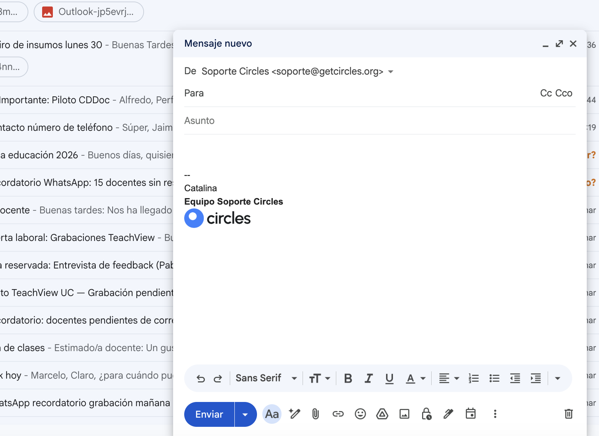
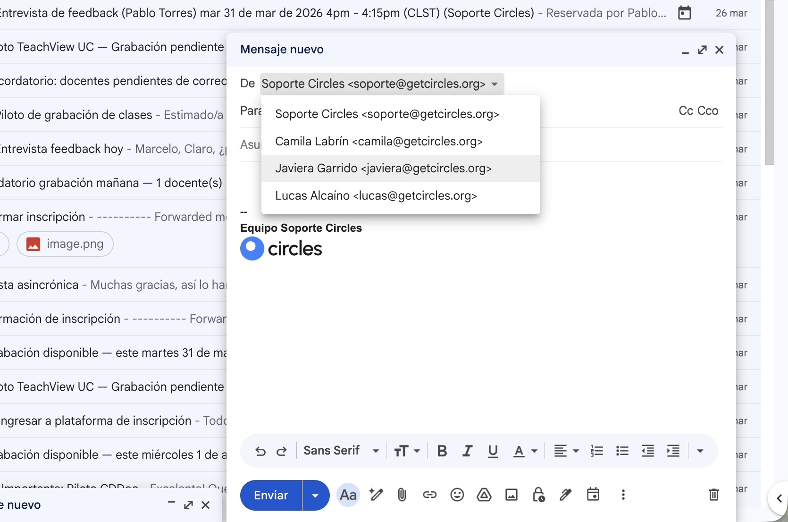

# Correo de soporte

**Cuenta:** soporte@getcircles.org

El correo de soporte es la cuenta compartida del equipo para comunicaciones formales con usuarios: envío de credenciales, notificaciones de baja, extensiones de plazo, y cualquier comunicación que requiera registro escrito.

## Cómo está organizado

La bandeja de soporte recibe correos de **todas las convocatorias** en una misma cuenta. Para no perder correos ni confundir proyectos, usamos un sistema de **etiquetas con colores** que clasifica automáticamente cada correo según la convocatoria a la que pertenece.

### Etiquetas por convocatoria

| Etiqueta | Color | Convocatoria |
|---|---|---|
| TeachView PUC | 🟣 Morado | Piloto TeachView — PUC |
| San Benito | 🟢 Verde | Colegio San Benito |
| SIP | 🔵 Azul | Red SIP |
| INACAP | 🔴 Rojo | INACAP |
| ChileMass | 🟡 Amarillo | ChileMass / Caja los Andes |
| Curso IA PUC | 🟠 Naranja | Curso IA — PUC |
| SLEP Tamarugal | 🟤 Marrón | SLEP Tamarugal |

Cada etiqueta tiene un **filtro automático** que clasifica los correos entrantes y salientes según el dominio del remitente o destinatario (ej: todos los correos de `@sip.cl` se etiquetan como SIP). No necesitas etiquetar correos manualmente.

## Ver correos de tu convocatoria

Para ver solo los correos de la convocatoria a la que estás asignado:

1. En el **panel izquierdo** de Gmail, busca la sección "Etiquetas"
2. Haz clic en la etiqueta de tu convocatoria (ej: "SIP")
3. Gmail mostrará solo los correos de ese proyecto

!!! tip
    Si no ves las etiquetas en el panel izquierdo, haz scroll hacia abajo. Las etiquetas aparecen debajo de las carpetas del sistema (Recibidos, Enviados, Borradores, etc.).

### Buscar dentro de una convocatoria

Si necesitas buscar un correo específico dentro de tu convocatoria, usa la barra de búsqueda con el formato:

```
label:nombre-etiqueta término de búsqueda
```

Ejemplos:

- `label:sip contraseña` — busca correos sobre contraseñas en SIP
- `label:inacap juan pérez` — busca correos de Juan Pérez en INACAP
- `label:slep-tamarugal credenciales` — busca correos de credenciales en SLEP Tamarugal

!!! note
    En las búsquedas, Gmail reemplaza los espacios del nombre de la etiqueta por guiones. "SLEP Tamarugal" se busca como `label:slep-tamarugal`.

## Correos sin etiqueta

Algunos correos pueden quedar sin etiqueta. Esto pasa cuando:

- El usuario escribe desde un **correo personal** (Gmail, Hotmail) que no coincide con ningún dominio institucional
- Es un correo **nuevo de una convocatoria** que aún no tiene filtro configurado

Si encuentras un correo sin etiqueta que debería tener una, puedes etiquetarlo manualmente: clic derecho sobre el correo → "Etiquetar como" → seleccionar la etiqueta correcta.

## Tu firma

Todos los correos se envían desde `soporte@getcircles.org`. La firma predeterminada es **"Asistente de Éxito Estudiantil"**, que incluye el texto "Equipo Soporte Circles" y el logo de Circles.

### Cómo firmar tus correos

Antes de enviar cualquier correo, **escribe tu nombre** arriba de "Equipo Soporte Circles" en la firma. Esto permite identificar quién del equipo envió cada mensaje.



!!! danger "Regla obligatoria"
    **Siempre agrega tu nombre en la firma antes de enviar.** Si no lo haces, el correo saldrá sin identificar quién lo envió. Esto dificulta el seguimiento del trabajo del equipo.

### Si tienes un alias propio

Algunos miembros del equipo tienen un **alias personal** con dominio @getcircles.org (ej: `camila@getcircles.org`). Si tienes uno:

1. Al redactar o responder un correo, haz clic en el campo **"De"** (arriba del campo "Para")
2. Selecciona tu alias en el menú desplegable
3. La firma se actualizará automáticamente con tu nombre



!!! note
    El alias no es una cuenta de correo independiente. No puedes iniciar sesión con él ni recibir correos ahí. Es solo una identidad de envío dentro de la bandeja compartida.

### Tu correo personal de Circles

Cada asistente tiene un **correo personal de Circles** (ej: `tunombre@circles.gmail.com`). Este correo se usa **exclusivamente** para:

- Recibir invitaciones a reuniones y Google Meet
- Ser copiado (CC) en correos internos de referencia
- Comunicación interna del equipo

**No** uses tu correo personal de Circles para responder a usuarios ni para enviar correos de soporte.

## Reglas para enviar correos

- **Siempre** agrega tu nombre en la firma antes de enviar (o selecciona tu alias si tienes uno)
- Usa las **plantillas estandarizadas** de la sección [Plantillas](plantillas.md) — personaliza los campos entre corchetes `[ ]` antes de enviar
- Si necesitas enviar un correo que no tiene plantilla, consulta con el SA Senior o la coordinación antes de enviarlo
- **Registra un ticket** en el Help Desk por cada interacción significativa con un usuario

!!! warning
    Recuerda que la cuenta de soporte es compartida. Cualquier correo que envíes será visible para todo el equipo. Mantén un tono profesional y revisa el destinatario antes de enviar.
