# Help Desk

**Link:** https://helpdesk.getcircles.org/

El Help Desk tiene dos elementos principales: el Sistema de Tickets y el Chat de Soporte.

## Sistema de tickets

El sistema de tickets permite gestionar las solicitudes e incidentes de los usuarios de forma organizada. Los tickets son la **memoria compartida del equipo** y el mecanismo principal de coordinación entre los SA que atienden el chat en distintos turnos.

### Cuándo crear un ticket

Se debe crear un ticket en el sistema de tickets cuando se cumpla al menos una de estas condiciones:

1. **La consulta tarda más de 5 minutos en resolverse** — si requiere investigación, pruebas o múltiples intercambios con el usuario.
2. **Hay que derivar el caso a otro miembro del equipo de soporte** — para que la persona que recibe el caso tenga contexto completo.

Las consultas rápidas que se resuelven en el momento no requieren ticket.

### Qué incluir en cada ticket

- **Correo del usuario** (cuando se conozca) — permite buscar tickets existentes antes de contactar a alguien
- **Descripción del problema**
- **Acciones tomadas** y por quién
- **Estado**: si fue resuelto o queda pendiente

Usar la sección de notas del ticket para agregar actualizaciones al historial.

### Antes de contactar a un usuario

Antes de escribirle a un usuario por cualquier canal, revisar si ya existe un ticket a su nombre en el sistema. Leer el historial y las notas para ponerse al día con el caso.

## Chat de soporte

En esta sección se encuentran todas las conversaciones de los usuarios con el Chatbot de Circles (+1 (650) 600-6132). Los usuarios acceden desde la app móvil o web. Las conversaciones se dividen en:

- **All Chats:** todas las conversaciones.
- **Human Support:** chats escalados a un agente humano (etiqueta "Escalated").
- **AI Support:** conversaciones gestionadas por el chatbot.

!!! note
    El Chat de Soporte no tiene notificaciones. Debes mantenerlo abierto en una pestaña para detectar nuevos mensajes.

### Sistema de turnos

Las consultas del Help Desk llegan de manera anónima, de cualquier convocatoria. No es posible filtrar ni asignar chats a un SA específico; a medida que el usuario entrega sus datos, se puede ir rellenando su información. Para asegurar cobertura continua sin que dos SA se pisen los talones, el chat funciona con un sistema de turnos:

- **Horario de cobertura:** 9:00 a 21:00.
- **Una sola persona por turno** — se asignan turnos por hora a cada SA según sus horarios disponibles.
- **Durante tu turno, contestas cualquier consulta que llegue**, sin importar si es de tu convocatoria o no. El chat es transversal a todas las convocatorias.
- **Lunes a viernes:** cobertura obligatoria, sin brechas. Si no puedes cubrir tu turno, avisa al SA Senior con anticipación para que busque reemplazo.
- **Sábado y domingo:** los turnos son voluntarios. Está bien si hay brechas, siempre y cuando no superen las 3 horas.

### Guía de Shifton para asistentes

Usamos [Shifton](https://app.shifton.com) para coordinar los turnos del chat de soporte. Cada turno dura **1 hora** y cubre el horario de 9:00 a 21:00 (12 turnos por día).

#### Cómo ingresar a Shifton

1. Entra a [app.shifton.com](https://app.shifton.com) con el correo y contraseña que te asignaron al crear tu cuenta.
2. También puedes descargar la app móvil **"Shifton"** (disponible en [App Store](https://apps.apple.com/us/app/shifton-work-scheduling/id1510772762) y [Google Play](https://play.google.com/store/apps/details?id=com.shifton.work)) e iniciar sesión con las mismas credenciales.

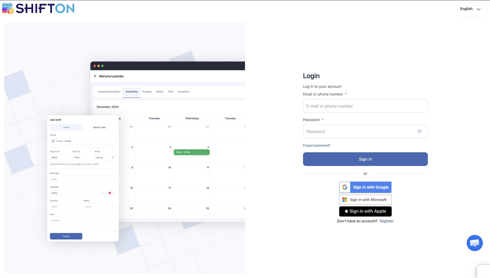

Al ingresar, verás dos vistas principales en el menú lateral izquierdo:

- **Dashboard**: tu calendario personal con los turnos que ya tienes tomados.
- **Schedule** (Horario): la vista completa del equipo, donde puedes ver y tomar turnos abiertos.

#### Dashboard (vista personal)

El Dashboard es tu vista personal. Muestra un calendario mensual con **solo tus turnos asignados**. Úsalo para revisar de un vistazo qué turnos tienes tomados durante la semana o el mes.

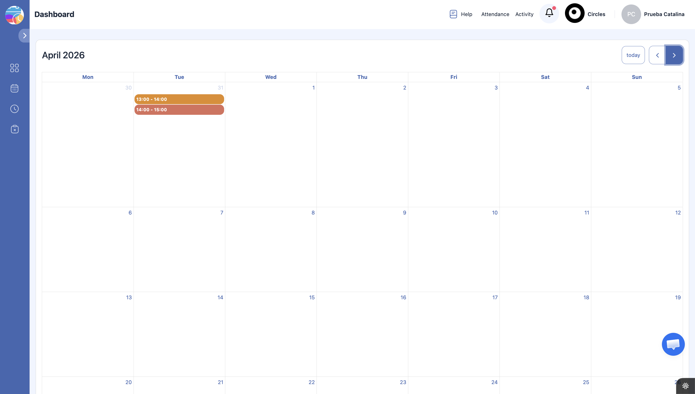

#### Schedule (horario del equipo)

La vista de **Schedule** muestra el horario completo del equipo. Aquí puedes ver:

- **Fila "Open Shifts"** (Turnos abiertos) en la parte superior: son los turnos disponibles que nadie ha tomado todavía.
- **Filas personales** de cada SA más abajo: muestran los turnos que cada persona ya tiene asignados.

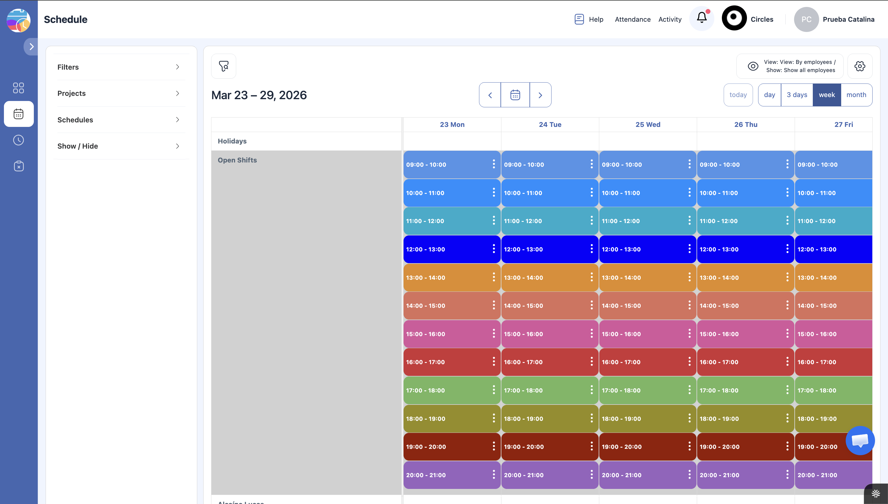

Puedes cambiar la vista entre día, 3 días, semana o mes usando los botones en la esquina superior derecha.

#### Cómo tomar un turno abierto

1. Ve a la vista de **Schedule**.
2. En la fila de **"Open Shifts"**, haz clic en el turno que quieras tomar (ej. "13:00 - 14:00" del martes). Aparecerá un tooltip con el nombre del turno.

    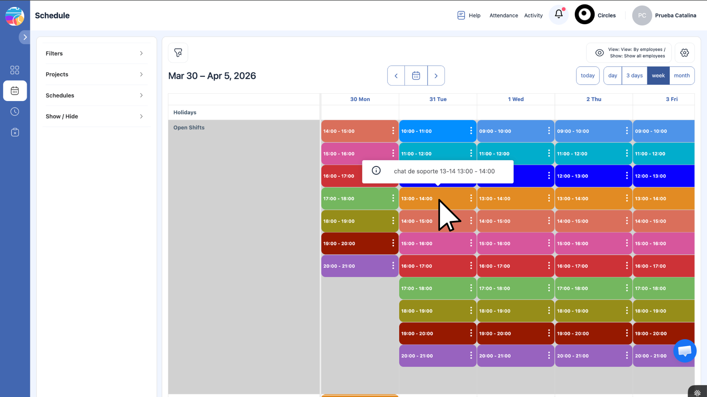

3. Se abrirá un panel lateral con el botón **"Take this shift"**. Haz clic en él para confirmar.

    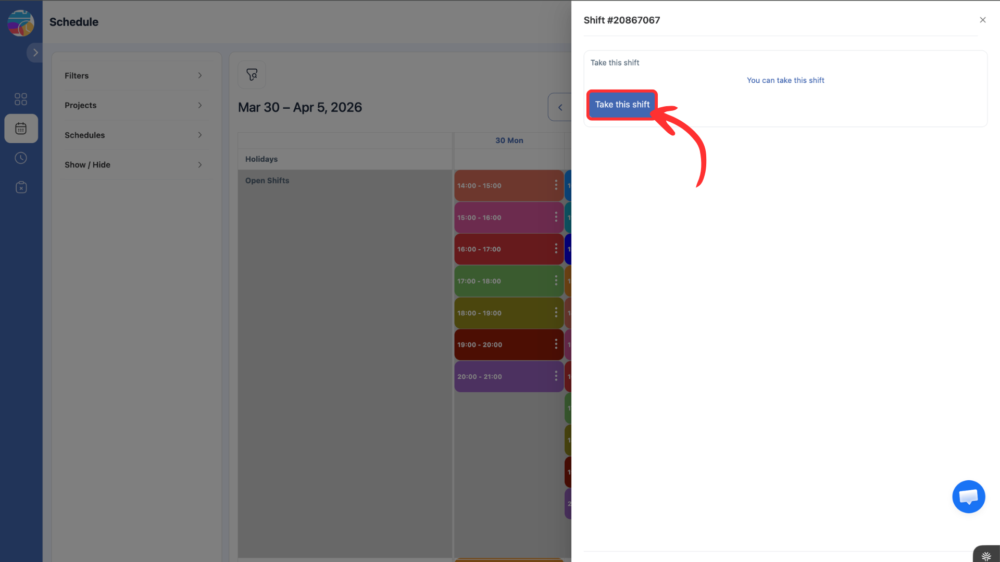

4. El turno desaparecerá de la fila de turnos abiertos y aparecerá en **tu fila personal** del calendario.

    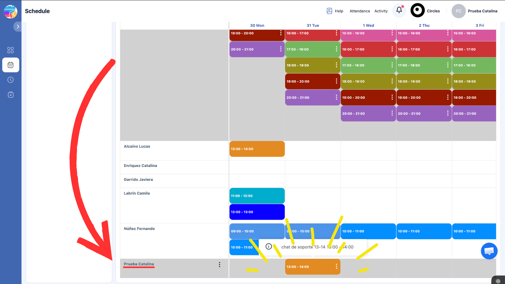

Puedes tomar turnos con la anticipación que quieras. No hay restricción semanal: si ya sabes tu disponibilidad del mes, puedes tomar todos tus turnos de una vez.

!!! note "Turnos de fechas y horas pasadas"
    Shifton no permite tomar turnos cuya fecha u hora ya pasaron. Si haces clic en un turno de una fecha pasada (o de una hora que ya transcurrió en el día de hoy), solo verás la opción de "Edit" pero no podrás tomarlo. Esto es normal — solo puedes tomar turnos futuros.

#### Cómo soltar un turno (devolverlo a turnos abiertos)

Si ya tomaste un turno pero no vas a poder cubrirlo, puedes enviarlo de vuelta a la lista de turnos abiertos para que otro SA lo tome:

1. En tu fila personal del calendario, haz clic en los **tres puntos** (⋮) que aparecen al lado del turno que quieres soltar. Selecciona **"Edit"**.

    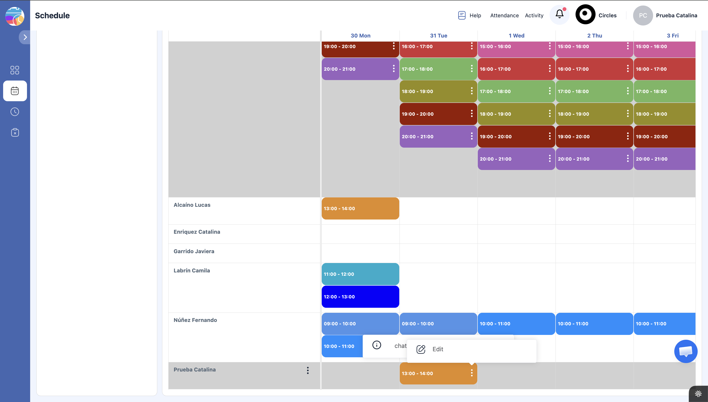

2. Se abrirá un panel lateral con varias opciones. En la sección **"MOVE TO OPEN SHIFTS"**, haz clic en el botón **"Move"**.

    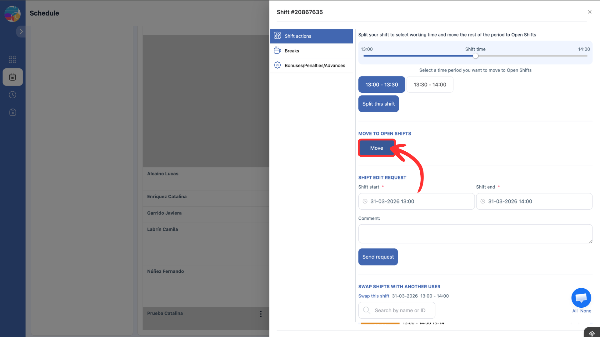

3. Aparecerá un diálogo de confirmación: "Do you want to send this shift to the list of available shifts?". Haz clic en **"Yes, I confirm"**.

    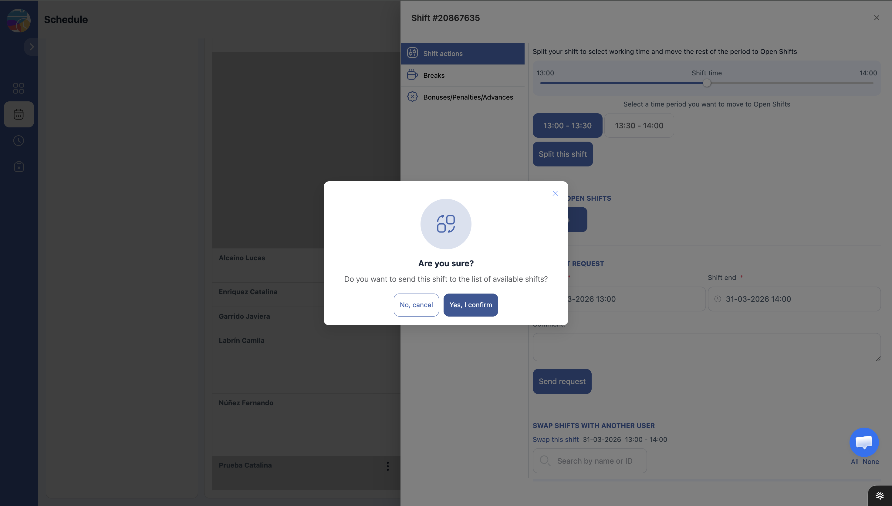

4. Se enviará una solicitud. **Un administrador debe aprobar la solicitud** antes de que el turno vuelva a estar disponible como turno abierto.

En el mismo panel también puedes **dividir un turno**: usa el slider de tiempo para seleccionar qué parte del turno quieres conservar y cuál enviar a turnos abiertos, y luego haz clic en "Split this shift".

!!! warning "Importante"
    Avisa al SA Senior con anticipación si necesitas soltar un turno, especialmente en días de semana. **No sueltes un turno el mismo día sin coordinar un reemplazo.** Si es de lunes a viernes, la cobertura es obligatoria y no puede quedar en blanco.

#### Cómo intercambiar un turno con otro SA

Si necesitas cambiar un turno y ya tienes a alguien que puede cubrirlo, pueden hacer un intercambio directo sin necesidad de aprobación de un administrador:

1. Coordina con tu compañero/a por el canal de comunicación del equipo para acordar qué turnos van a intercambiar.
2. En tu fila personal del calendario, haz clic en los **tres puntos** (⋮) del turno que quieres intercambiar y selecciona **"Edit"** (mismo paso que para soltar un turno).

    

3. En el panel lateral, baja hasta la sección **"SWAP SHIFTS WITH ANOTHER USER"**. Verás la lista de turnos de tus compañeros disponibles para intercambiar. No importa que el horario sea diferente — puedes intercambiar un turno de 10:00-11:00 por uno de 16:00-17:00 sin problema.
4. Marca con el checkbox el turno de tu compañero/a que quieres recibir a cambio, y haz clic en **"Initiate swap"**.

    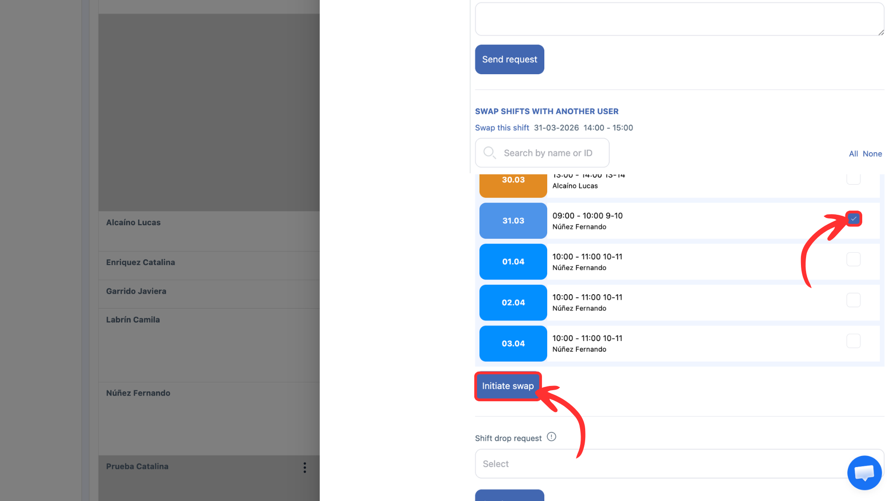

5. Tu compañero/a recibirá una notificación y deberá confirmar el intercambio desde su cuenta.
6. Una vez confirmado por ambas partes, los turnos se intercambian automáticamente en el calendario.

!!! tip "Ventaja del intercambio"
    El intercambio entre compañeros **no requiere aprobación de un administrador** (a diferencia de soltar un turno). Es la forma más rápida de resolver un cambio de horario.

#### Registro de horas y pago

Como estipula el contrato, existe una tarifa diferenciada entre trabajo realizado durante días de semana (lunes a viernes) y trabajo realizado durante fines de semana y feriados.

Cada turno del chat de soporte debe ser registrado como hora trabajada en la **planilla de registro de horas trabajadas**, junto con todas las demás horas que se hayan destinado a otras labores del puesto de trabajo (seguimiento proactivo, correos, revisión de consolidado, tickets, etc.).

Es responsabilidad de cada asistente de soporte el registro completo y fidedigno de todas sus horas trabajadas en la planilla, **al final de cada día laboral**. No se aceptan registros retroactivos de varios días.

!!! info "Monitoreo de actividad en el Help Desk"
    El Help Desk cuenta con una función de seguimiento de actividad que registra cuándo los asistentes inician sesión, cuándo salen y si están activos respondiendo consultas. Esta información se utiliza como referencia complementaria para coordinar la cobertura del chat y verificar que los turnos tomados en Shifton estén siendo cubiertos correctamente.

### Protocolo de delegación — Regla de los 5 minutos

El chat de soporte es transversal: cualquier SA que esté de turno contesta cualquier consulta, sin importar la convocatoria. Pero hay consultas que requieren conocimiento específico de una convocatoria o un seguimiento más largo. Para esos casos, se delega.

**Regla: si la consulta no se puede resolver en 5 minutos o menos, se delega al SA asignado a esa convocatoria.**

**Lo que SÍ se resuelve en turno** (< 5 min):

- Problemas de acceso o contraseña
- Cómo descargar la app
- Cómo unirse a un círculo
- Cómo subir una entrega
- Preguntas generales sobre la plataforma

**Lo que se delega** (> 5 min o requiere contexto):

- Estudiante inactivo que necesita seguimiento
- Problemas con un círculo específico (compañeros inactivos, conflictos)
- Consultas sobre contenido del curso o fechas específicas de una convocatoria
- Casos que requieren revisar el consolidado del curso
- Bugs o problemas técnicos que necesitan escalamiento

#### Cómo delegar

1. **Crear o actualizar el ticket** en el sistema de tickets con toda la información del caso.
2. **Notificar al SA asignado** a esa convocatoria por el canal interno del equipo.
3. **Responder al usuario** en el chat: "Tu caso quedó registrado y un asistente especializado en tu curso te va a contactar pronto."

!!! tip "A quién delegar"
    Consulta la tabla de asignación por convocatoria en el **Torpedo de Soporte**. Ahí figuran los SA y SA Seniors asignados a cada convocatoria.

### Regla de handoff (traspaso entre SA)

Si durante tu turno atiendes un caso que es de otra convocatoria y no logras resolverlo en el momento:

1. Deja el ticket con notas claras de lo que hiciste y lo que falta por resolver.
2. Avisa al SA asignado a esa convocatoria para que haga el seguimiento posterior.

**El turno del chat es para dar la primera respuesta. El seguimiento profundo lo hace el SA asignado al curso.** Esto asegura que el usuario recibe atención inmediata, pero que el caso queda en manos de quien conoce mejor esa convocatoria.

### Responder chats escalados

Selecciona la pestaña **"Human Support"** para ver todos los chats que requieren atención humana (etiqueta "Escalated").

!!! danger "Regla de los 60 minutos"
    Las conversaciones escaladas deben responderse **dentro de 60 minutos**. Este es el tiempo máximo antes de que la conversación se desactive y ya no puedas escribir libremente al usuario.

#### Antes de responder: leer todo el contexto

Antes de escribir cualquier respuesta, **lee la conversación completa desde el principio**. Esto incluye:

- Lo que el usuario le dijo al chatbot
- Las respuestas que dio el chatbot
- La nota interna del sistema (mensaje "INTERNAL") con datos del usuario
- Cualquier mensaje previo de otro SA

Esto es fundamental para no hacerle repetir al usuario su problema o consulta. El usuario ya explicó su situación al chatbot y espera que tú la conozcas.

!!! warning "No preguntes lo que ya está en la conversación"
    Si el usuario ya dijo "no puedo entrar con mi contraseña" al chatbot, **no le preguntes cuál es su problema**. En su lugar, empieza directamente con la solución o con una pregunta específica de seguimiento.

#### Apoyarse en las herramientas disponibles

Antes y durante la atención de un chat, usa todas las herramientas a tu disposición para investigar el caso:

- **Admin Circles**: busca al usuario por correo para ver su estado, curso, círculo, progreso y actividad
- **Consolidado**: revisa la hoja de cálculo para ver datos adicionales (sede, cargo, comentarios de otros asistentes)
- **Sistema de tickets**: verifica si ya existe un ticket previo para ese usuario

Cuanto más contexto tengas antes de responder, mejor será la atención.

### Conversaciones inactivas (después de 60 minutos)

Si no se responde dentro de los 60 minutos, la conversación se desactiva. En este estado ya no puedes escribir mensajes libres — solo puedes enviar una **plantilla predefinida** para reactivar la conversación.

#### Cómo reactivar una conversación inactiva

1. Abre la conversación inactiva. Verás el botón **"Send Template"** en la parte inferior.

    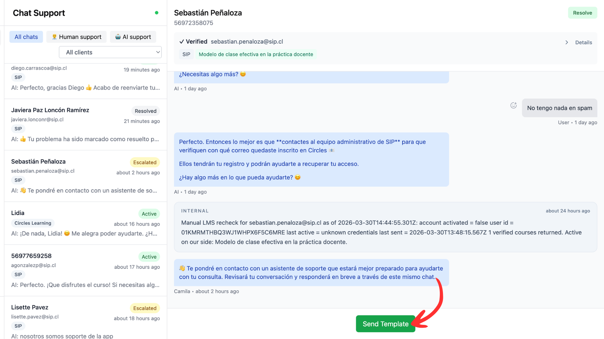

2. Haz clic en **"Send Template"**. Se abrirá un diálogo para seleccionar la plantilla.

3. Selecciona el idioma **"Español"** y luego la plantilla **"Agent Follow-up (Unresolved)"**. Haz clic en **"Send"**.

    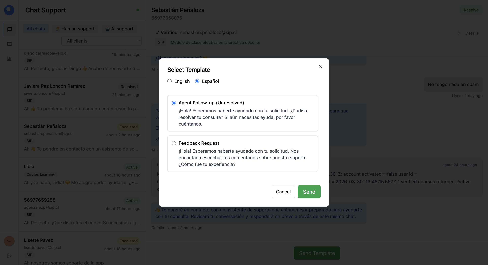

4. El usuario recibirá un mensaje automático preguntándole si aún necesita ayuda. **Si el usuario responde, la conversación se reactiva** y podrás escribir libremente de nuevo.

!!! note "Estar atento a la reactivación"
    Después de enviar la plantilla, mantente atento a la respuesta del usuario. Cuando responda, la conversación volverá a aparecer como activa en la pestaña "Human Support" y debes atenderla.

#### Si el usuario no responde

Si el usuario no responde a la plantilla de follow-up, puedes cerrar la conversación con el botón **"Resolve"** y un mensaje de cierre como:

> *Dado que no estás activo en el chat daremos la conversación como resuelta, pero si sigues con la duda siempre puedes solicitar hablar con un agente humano en este mismo chat y retomamos la conversación.*

### Tomar conversaciones donde la IA no ayuda

Si detectas que el chatbot no está resolviendo la consulta del usuario, toma la conversación manualmente.

### Resolver conversaciones

Una vez solucionado el problema, marca el chat como "resuelto" con el botón **"Resolve"** en la esquina superior derecha.

### Editar información del usuario

El chatbot recopila nombre, teléfono, correo y cursos durante la conversación. Si la conversación escala a un agente humano, debes ingresar esta información manualmente con la opción "Editar" en el recuadro de datos del chat.

### Ingresar disponibilidad horaria

En el Help Desk debes registrar tu **disponibilidad horaria general para trabajar con Circles** (no confundir con los turnos del chat de soporte, que se gestionan en Shifton).

Esta disponibilidad le permite a la coordinación saber en qué horarios puedes realizar tus tareas (seguimiento, correos, consolidado, etc.) y planificar la asignación de trabajo.

#### Cómo ingresar tu disponibilidad

1. En el Help Desk, haz clic en tu **foto de perfil** en la esquina inferior izquierda para acceder a **"My Profile"**.

    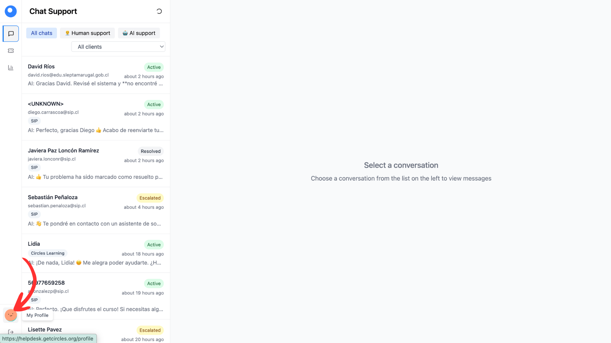

2. En tu perfil, haz clic en **"Edit availability"** en la sección "My Availability".

    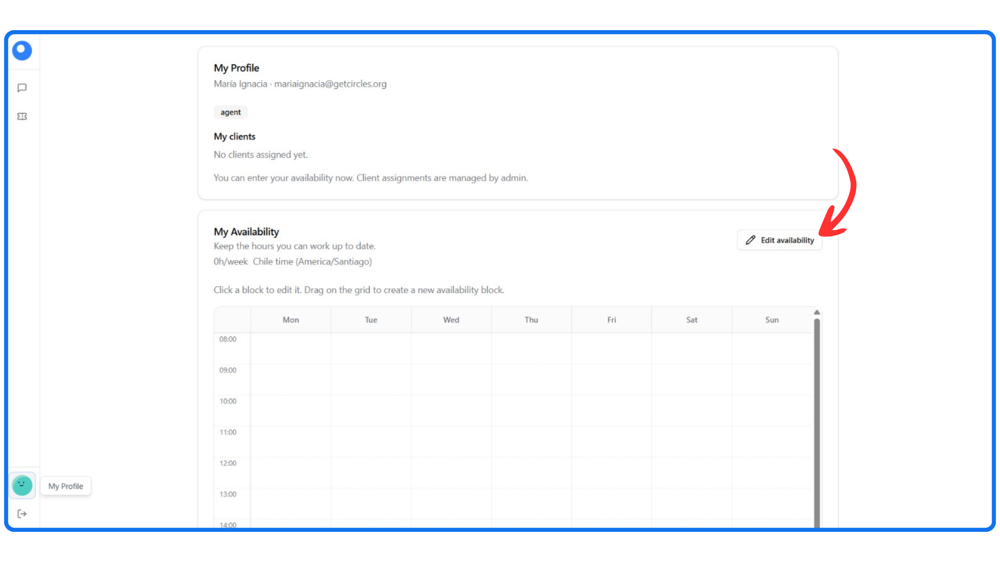

3. Agrega todos los bloques de horario en los que estás disponible para trabajar. Puedes hacer clic y arrastrar sobre la grilla para crear bloques, o usar el botón **"+ Add availability"**.

4. Cuando hayas ingresado todos tus horarios, haz clic en **"Done editing"** para guardar los cambios.

    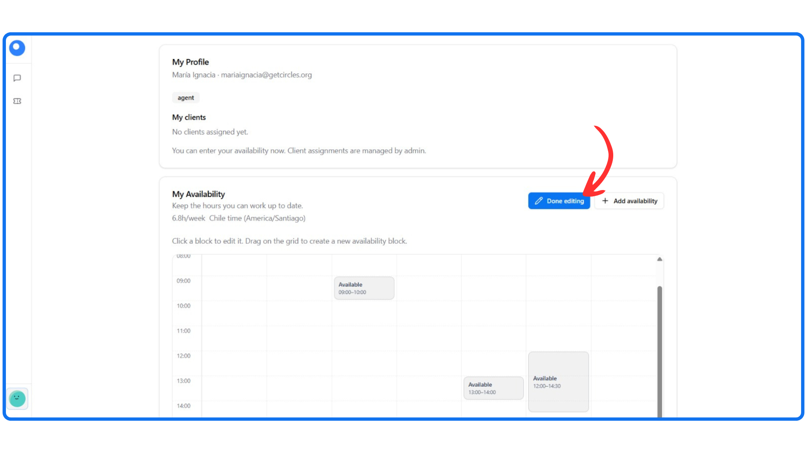

!!! note
    Si tu disponibilidad cambia (por ejemplo, por un cambio de horario en la universidad), actualízala lo antes posible para que la coordinación pueda ajustar la planificación.
