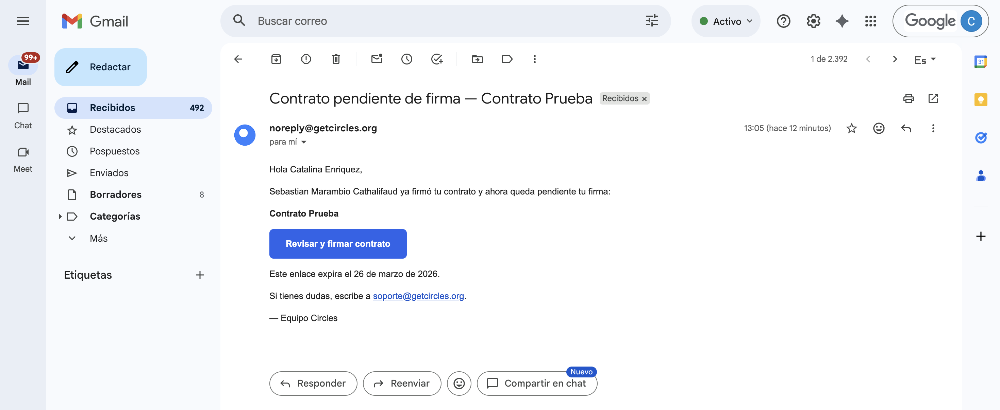
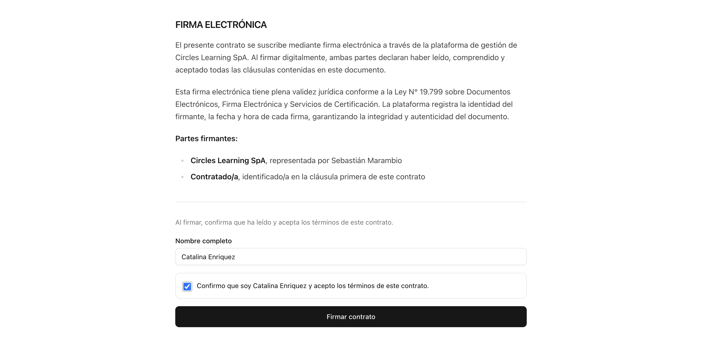

# Onboarding de nuevos miembros

Si eres nuevo/a en el equipo de soporte, esta sección te guiará en tus primeros días. El objetivo es que en una semana te sientas cómodo/a operando de forma autónoma.

## Contrato

Una vez que seas aceptado para el trabajo, se te enviará un correo electrónico con todos los detalles de la convocatoria, incluyendo:

- Tamaño de la cohorte
- Fechas
- Enlaces a recursos de trabajo
- Otros

Asimismo, se te solicitará tu información personal para poder enviarte un borrador de contrato. Recibirás este contrato al correo electrónico que declares en tu postulación, titulado "Contrato pendiente de firma". Al ingresar, debes seleccionar el botón "Revisar y firmar contrato", lo cual te llevará a un enlace en nuestra plataforma para que puedas revisar el contenido del contrato.

Al ingresar al enlace, debes revisar minuciosamente el contenido de todo el contrato y verificar que la información sea correcta. Una vez hecho eso, baja hasta el fondo del documento y marca el checkbox donde confirmas tu identidad y que aceptas los términos del contrato.

Una vez marcado, se habilitará el botón "Firmar contrato". Al seleccionarlo, el contrato quedará listo con las firmas de ambas partes, y automáticamente recibirás un PDF del contrato firmado en tu mismo correo electrónico.

## Correo soporte

El equipo de soporte utiliza una cuenta de Gmail compartida para gestionar todas las comunicaciones con los usuarios de los distintos proyectos.

!!! note "Datos de acceso"
    **Correo**: soporte@getcircles.org
    **Contraseña**: soporteCircles123

### Sistema de filtros y labels

Para organizar los correos por proyecto, la cuenta utiliza **filtros automáticos de Gmail** que asignan etiquetas (labels) de colores a cada conversación según su origen. Esto permite identificar rápidamente a qué proyecto pertenece cada correo sin tener que leerlo.

Los filtros funcionan principalmente por **dominio de correo electrónico**. Por ejemplo, todos los correos que vienen de o van hacia `@colegiosanbenito.org` reciben automáticamente la etiqueta `San-Benito`. Los labels activos son:

| Label | Proyecto | Cómo se filtran |
|---|---|---|
| `TeachView-PUC` | Piloto TeachView UC | Alias `teachview@getcircles.org` + CDDoc |
| `San-Benito` | Colegio San Benito | Dominio `@colegiosanbenito.org` |
| `SIP` | Red SIP | Dominio `@sip.cl` |
| `INACAP` | INACAP | Dominios `@inacap.cl` y `@inacapmail.cl` |
| `Curso-IA-PUC` | Curso IA para docentes UC | Dominio `@uc.cl` (excluyendo TeachView) |
| `ChileMass` | ChileMass | Keywords en asunto (temporal) |
| `SLEP-Tamarugal` | SLEP Tamarugal | Dominio `@sleptamarugal.gob.cl` + keywords |

Para ver los correos de un proyecto específico, simplemente haz click en el label correspondiente en el panel izquierdo de Gmail.

### Mantenimiento de filtros

Cuando se incorpora un **nuevo proyecto**, se debe crear un label y un filtro nuevo (idealmente basado en dominio). Si un proyecto utiliza correos `@uc.cl`, hay que agregar una exclusión al filtro de `Curso-IA-PUC` para evitar duplicados. Cuando un proyecto termina, se puede ocultar su label haciendo click derecho → "Ocultar".

## Semana 1: Checklist de incorporación

1. Lee este manual completo, con énfasis en las secciones de Herramientas, Responsabilidades y Problemas y respuestas.
2. Solicita acceso a: Admin Circles, Help Desk, Base de Datos, grupo de WhatsApp del equipo y correo del equipo.
3. Agenda una sesión de inducción con tu Coordinador/a para recorrer las herramientas en vivo.
4. Observa a un asistente experimentado durante 1-2 días: cómo responde chats, cómo registra tickets, cómo actualiza la base de datos.
5. Responde tus primeros chats con supervisión del Coordinador/a.
6. Familiarízate con las plantillas de mensajes y practica personalizarlas.
7. Al final de la semana, revisa con tu Coordinador/a las dudas que hayas acumulado.

## Tu contacto principal

Durante tu primer mes, tu contacto para cualquier duda operativa es tu Coordinador/a de Soporte asignado. No dudes en consultar; es preferible preguntar a cometer un error que afecte al usuario.
