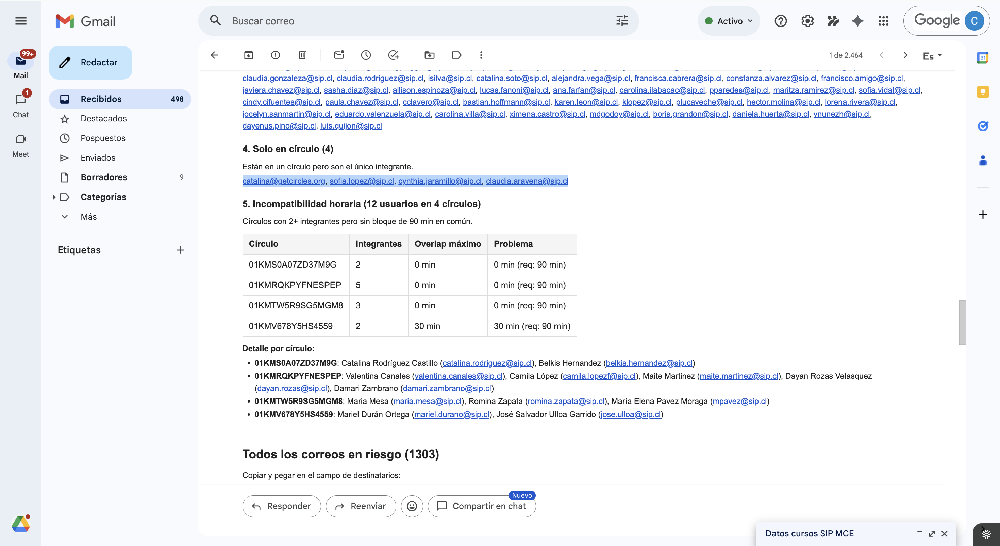
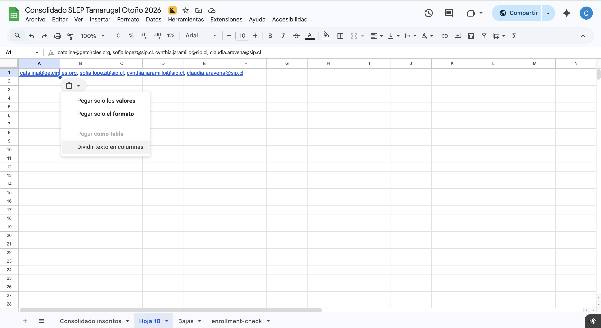
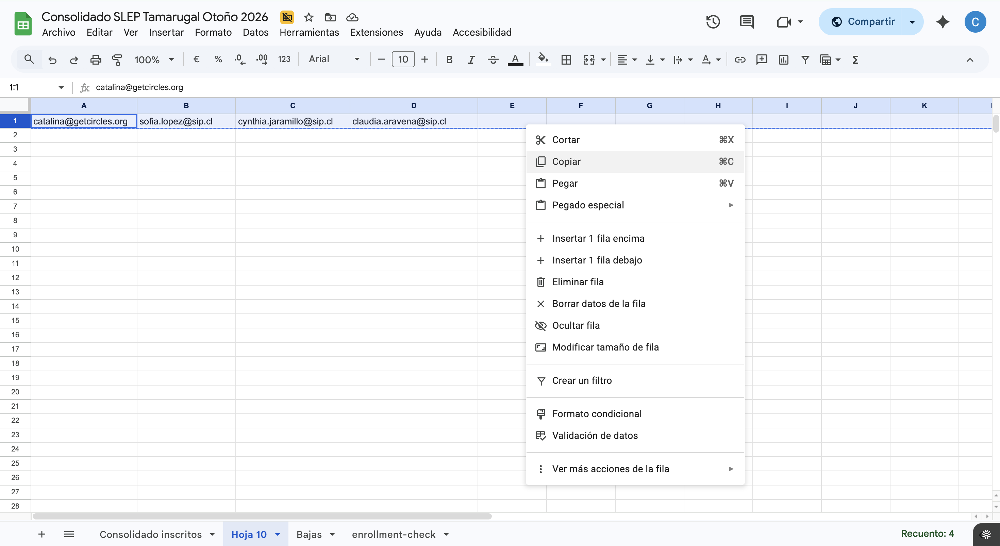
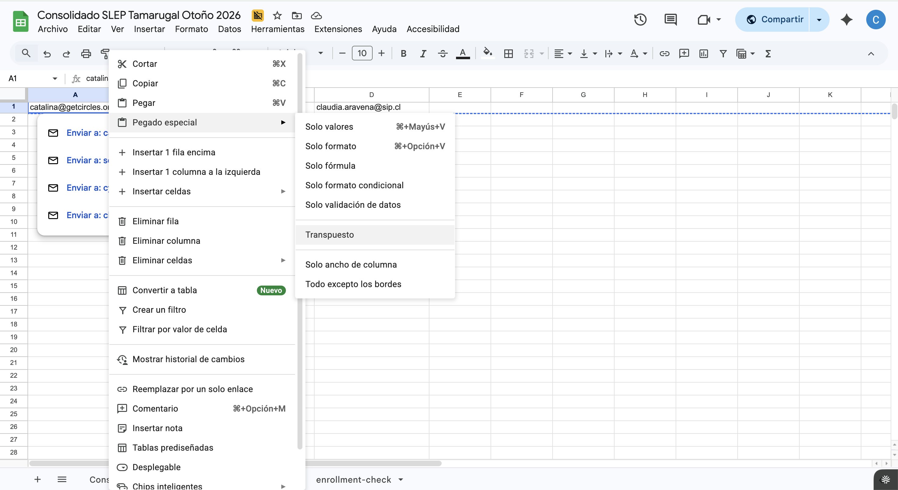
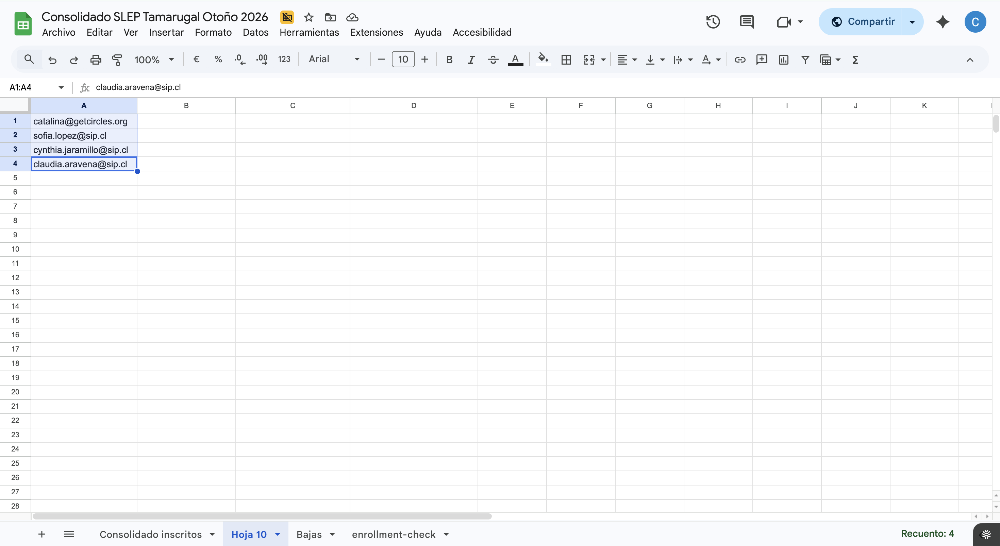

# Registro de datos

La base de datos es una hoja de cálculo compartida (Google Sheets) que centraliza la información de todos los inscritos de todas las convocatorias.

## Estructura del consolidado

El archivo tiene dos tipos de pestañas:

### Pestaña "Consolidado"

Es la **pestaña principal**. Contiene una fila por cada inscrito de todas las convocatorias, con los siguientes campos:

| Campo | Descripción | Ejemplo |
|---|---|---|
| **Curso** | Nombre del curso al que está inscrito | Clase Efectiva — Docentes |
| **Nombre** | Nombre completo del inscrito | María José Pérez González |
| **Género** | Género del inscrito | Femenino |
| **RUT** | RUT con puntos y guión | 12.345.678-9 |
| **Teléfono** | Número de contacto con código de país | +56 9 1234 5678 |
| **Correo** | Correo electrónico de inscripción | maria.perez@sip.cl |
| **Sede** | Sede o establecimiento del inscrito | Liceo Bicentenario |
| **Cargo** | Cargo o rol dentro de la institución | Docente de Matemáticas |

!!! note
    Un mismo inscrito puede aparecer en **más de una fila** si está en más de un curso. Siempre usa Buscar (Ctrl+F) para verificar si alguien ya existe antes de agregar una fila.

### Pestañas por curso

Cada curso tiene su propia pestaña de seguimiento con las columnas: Stage, Email, Name, Last Name, Host, Reunión, Módulos (1-4), Comentarios Asistente y Comentarios Coordinador.

Los stages posibles son: "Meeting Scheduled" (en un grupo con reunión agendada), "Circle member" (en un grupo sin reunión agendada), "New user" (ingreso reciente) y "Prospect" (aún no entra a la plataforma).

## Google Sheets básico

Si no has usado mucho Google Sheets, estas son las funcionalidades que vas a necesitar para trabajar con el consolidado.

### Inmovilizar filas

La primera fila del consolidado tiene los encabezados de las columnas. Para que siempre estén visibles al hacer scroll:

1. Ve a **Ver → Inmovilizar → 1 fila**

Esto fija la fila de encabezados en la parte superior de la hoja, sin importar cuánto bajes.

<!-- TODO: agregar pantallazo de Ver → Inmovilizar -->

### Filtros

Los filtros permiten ver solo las filas que cumplen cierta condición (ej: solo inscritos de un curso específico).

1. Selecciona la fila de encabezados
2. Ve a **Datos → Crear un filtro**
3. Aparecerá un ícono de embudo (▼) en cada columna
4. Haz clic en el ▼ de la columna que quieras filtrar
5. Desmarca "Seleccionar todo" y marca solo los valores que quieras ver
6. Haz clic en **Aceptar**

Para quitar el filtro: **Datos → Quitar filtro**.

<!-- TODO: agregar pantallazo de filtro aplicado -->

!!! tip
    Usa filtros para ver solo los inscritos de tu convocatoria. Filtra la columna "Curso" y selecciona solo los cursos que te corresponden.

### Ordenar

Para ordenar los datos por una columna (ej: ordenar por nombre alfabéticamente):

1. Haz clic en cualquier celda de la columna que quieras ordenar
2. Ve a **Datos → Ordenar hoja por columna [X], A→Z** (o Z→A para orden inverso)

### Buscar y reemplazar

- **Buscar:** Ctrl+F (o Cmd+F en Mac) — busca texto en toda la hoja
- **Buscar y reemplazar:** Ctrl+H (o Cmd+H en Mac) — busca y reemplaza texto en toda la hoja o en un rango seleccionado

<!-- TODO: agregar pantallazo de buscar y reemplazar -->

### Relleno automático

Si necesitas copiar una fórmula o un valor a muchas filas:

1. Escribe el valor o fórmula en la primera celda
2. Selecciona la celda
3. Arrastra el **cuadrado azul** de la esquina inferior derecha hacia abajo (o hacia la dirección que necesites)

Google Sheets copiará el contenido ajustando las referencias automáticamente.

### Seleccionar rangos rápidamente

- **Seleccionar toda una columna:** clic en la letra de la columna (ej: A, B, C)
- **Seleccionar toda una fila:** clic en el número de la fila
- **Seleccionar hasta el final de los datos:** selecciona una celda, luego Ctrl+Shift+Fin (o Cmd+Shift+Fin en Mac)

## Fórmulas útiles

Estas tres fórmulas te van a servir para limpiar y buscar datos en el consolidado.

### NOMPROPIO — corregir mayúsculas en nombres

Convierte un texto a formato de nombre propio (primera letra de cada palabra en mayúscula, el resto en minúscula).

```
=NOMPROPIO(A2)
```

| Antes | Después |
|---|---|
| MARÍA JOSÉ PÉREZ | María José Pérez |
| juan carlos silva | Juan Carlos Silva |

Útil cuando los datos vienen en mayúsculas desde formularios de inscripción.

### ESPACIOS — eliminar espacios extra

Elimina espacios dobles y espacios al inicio/final de un texto.

```
=ESPACIOS(A2)
```

| Antes | Después |
|---|---|
| "  María   Pérez  " | "María Pérez" |

Útil para limpiar datos pegados desde otras fuentes.

### BUSCARV — buscar datos entre pestañas

Busca un valor en la primera columna de un rango y devuelve el valor de otra columna en la misma fila.

```
=BUSCARV(valor_buscado; rango; número_columna; FALSO)
```

Ejemplo: buscar el teléfono de un inscrito por su correo:

```
=BUSCARV("maria.perez@sip.cl"; Consolidado!C:F; 4; FALSO)
```

Esto busca `maria.perez@sip.cl` en la columna C del Consolidado y devuelve el valor de la columna F (4 columnas después).

!!! warning
    Recuerda que Google Sheets en español usa **punto y coma** (`;`) como separador de argumentos, no coma.

## Copiar correos de reportes al consolidado

Los reportes automáticos que llegan por correo (como el reporte de Match o el de usuarios en riesgo) incluyen listas de correos electrónicos separados por comas. Si necesitas hacer seguimiento de esos usuarios — por ejemplo, para ir marcando a quiénes ya contactaste — puedes copiar esos correos y pegarlos como una columna en Google Sheets.

### Paso 1: Copiar los correos del reporte

Abre el correo del reporte (Match, usuarios en riesgo, etc.) y selecciona la lista de correos. Copia con Ctrl+C (Cmd+C en Mac).



### Paso 2: Pegar y dividir en columnas

Abre el consolidado (o una hoja auxiliar) y pega los correos en una celda. Los correos quedarán todos juntos en una sola celda, separados por comas.

Al pegar, aparecerá un pequeño ícono de pegado. Haz clic en él y selecciona **"Dividir texto en columnas"**. Google Sheets separará cada correo en su propia celda, distribuyéndolos a lo largo de la fila.



### Paso 3: Copiar la fila

Ahora los correos están en una fila (horizontal). Selecciona la fila completa haciendo clic en el número de fila, luego clic derecho → **Copiar** (o Ctrl+C).



### Paso 4: Pegado especial transpuesto

Haz clic en la celda donde quieres que empiece la columna de correos. Luego haz clic derecho → **Pegado especial** → **Transpuesto**.

Esto convierte la fila (horizontal) en una columna (vertical).



### Resultado

Los correos quedan ordenados en una columna, uno por fila. Desde aquí puedes agregar columnas adicionales para hacer seguimiento (ej: "Contactado", "Fecha", "Notas").



!!! tip
    Puedes usar esta misma técnica con cualquier lista de correos separados por comas, no solo con los reportes automáticos.

## Bajas

!!! note
    Solo se debe dar de baja a inscritos que solicitan la baja explícitamente.

Para dar de baja: cortar la fila completa del Consolidado y pegarla en la pestaña de Bajas. Esta pestaña incluye columnas adicionales: Motivo, Fecha de la baja, Quién lo dio de baja y ¿Hizo Match?.

Siempre pregunta al docente el motivo de la baja. Si no lo indica, el asistente puede deducirlo, señalando que no se dio un motivo explícito. Registrar si hizo match es prioritario para identificar si la falta de grupo fue determinante.

### Qué casos contabilizar como bajas

No toda salida de un usuario se registra de la misma forma. A continuación se definen los criterios para determinar qué casos deben contabilizarse como baja formal en la pestaña de Bajas y en los reportes de retención.

**Casos que SÍ cuentan como baja:**

| Caso | Descripción | Acción |
|---|---|---|
| **Baja explícita** | El usuario solicita directamente ser dado de baja del curso. | Registrar en Bajas con el motivo indicado por el usuario. |
| **Desvinculación laboral** | El usuario ya no trabaja en la institución asociada al curso. | Registrar en Bajas con motivo "Desvinculación laboral". Informar a Coordinación. |
| **Inactividad prolongada sin respuesta** | El usuario dejó de participar y no responde a ningún intento de contacto (plataforma, correo, llamada y WhatsApp) durante 3 semanas o más. | Registrar en Bajas con motivo "Inactividad / sin respuesta". Requiere aprobación de Coordinación antes de ejecutar la baja. |
| **Incompatibilidad horaria sin solución** | El usuario no puede reunirse con ningún círculo disponible y no existe posibilidad de reubicación. | Registrar en Bajas con motivo "Sin compatibilidad horaria". Solo después de que Coordinación haya agotado las opciones. |
| **Razones personales o de salud** | El usuario comunica que no puede continuar por motivos personales, familiares o de salud. | Registrar en Bajas con el motivo indicado. Responder con empatía e invitar a sumarse en una futura oportunidad. |
| **Problemas técnicos irresolubles** | El usuario no puede acceder a la plataforma y las alternativas ofrecidas (app web, cambio de correo) no funcionan. | Registrar en Bajas con motivo "Problemas técnicos". Solo después de agotar todas las soluciones con apoyo de Coordinación. |

**Casos que NO cuentan como baja:**

| Caso | Descripción | Qué hacer en su lugar |
|---|---|---|
| **Cambio de círculo** | El usuario sale de un círculo para unirse a otro. | No registrar en Bajas. Actualizar la pestaña del curso con el nuevo círculo. |
| **Salida accidental de un círculo** | El usuario se salió por error y necesita ser reintegrado. | No registrar en Bajas. Escalar a Coordinación para reintegro. |
| **Inactividad temporal (< 3 semanas)** | El usuario dejó de participar recientemente pero aún no se han agotado los intentos de contacto. | No registrar en Bajas. Seguir el protocolo de contacto: plataforma → correo → llamada → WhatsApp. |
| **Cambio de correo** | El usuario necesita ingresar con un correo diferente. | No registrar en Bajas. Escalar a Coordinación para gestionar el cambio de cuenta. |
| **Pausa comunicada** | El usuario avisa que estará ausente temporalmente pero planea continuar. | No registrar en Bajas. Documentar en Comentarios del Asistente y dar seguimiento en la fecha indicada. |

### Cómo dar de baja a usuarios

Cuando un usuario solicita ser dado de baja del curso, el asistente debe seguir estos pasos:

1. **Confirmar la intención:** Verificar que el usuario realmente desea darse de baja y que no es un error o un momento de frustración. Si el usuario eliminó su cuenta, contactarlo para confirmar que fue intencional.
2. **Preguntar el motivo:** Siempre preguntar al usuario por qué desea darse de baja. Registrar el motivo textual en el campo de "Motivo" en la pestaña de Bajas y en el Consolidado.
3. **Clarificar motivos ambiguos:** Algunos motivos requieren mayor detalle para poder clasificarlos correctamente en los reportes. Ver la tabla a continuación.
4. **Registrar si hizo Match:** Verificar en Admin si el usuario hizo Match (columna "Did User Match"). Este dato es obligatorio.
5. **Ejecutar la baja en Admin:** Remover al usuario del curso en Admin Circles (ver procedimiento en "Registro de bajas en Admin Circles" más abajo).
6. **Ejecutar la baja en el Consolidado:** Mover la fila del usuario desde el Consolidado a la pestaña de Bajas (ver procedimiento detallado a continuación).

**Motivos que requieren clarificación antes de registrar la baja:**

| Motivo reportado por el usuario | Qué clarificar | Por qué importa |
|---|---|---|
| **"Incompatibilidad de horarios"** o **"problemas de horario"** | Preguntar y registrar explícitamente si se trata de: (a) incompatibilidad de horarios **entre los miembros del círculo** para coordinar reuniones, o (b) un cambio en el **horario laboral del usuario** que le impide seguir participando. | La causa (a) es responsabilidad de Circles y se contabiliza como baja en reportes. La causa (b) es externa y no se contabiliza. Registrar la clarificación en el campo "Motivo" del Consolidado y de la pestaña de Bajas. |
| **"Mucho trabajo"** o **"no tengo tiempo"** | Preguntar si se refiere a carga laboral de su trabajo o a la carga del curso de Circles. | Aunque ambas se registran como baja, la distinción ayuda a identificar patrones en los reportes. |

### Paso a paso: mover la fila del Consolidado a Bajas

Una vez confirmada la intención del usuario, preguntado el motivo y verificado el Match, hay que mover su fila desde la pestaña principal del Consolidado a la pestaña de Bajas.

<!-- TODO: agregar pantallazo del consolidado mostrando la fila a cortar -->

1. **Buscar al usuario en el Consolidado:** Usa Ctrl+F (o Cmd+F en Mac) y busca por correo electrónico. Verifica que sea la fila correcta (nombre, curso).

2. **Seleccionar la fila completa:** Haz clic en el número de fila a la izquierda para seleccionar toda la fila.

    <!-- TODO: agregar pantallazo de fila seleccionada -->

3. **Cortar la fila:** Haz clic derecho → **Cortar** (o Ctrl+X / Cmd+X). La fila quedará marcada con una línea punteada.

4. **Ir a la pestaña de Bajas:** Haz clic en la pestaña "Bajas" en la parte inferior de la hoja de cálculo.

    <!-- TODO: agregar pantallazo mostrando la pestaña Bajas -->

5. **Ubicar la última fila con datos:** Baja hasta encontrar la primera fila vacía después de los datos existentes.

6. **Pegar la fila:** Haz clic derecho en el número de la fila vacía → **Pegar** (o Ctrl+V / Cmd+V). Los datos del usuario aparecerán en la pestaña de Bajas.

7. **Completar los campos adicionales de la pestaña de Bajas:**

    | Campo | Qué registrar |
    |---|---|
    | **Motivo** | Motivo textual indicado por el usuario (o deducido, señalando que no fue explícito) |
    | **Fecha de la baja** | Fecha en que se ejecutó la baja (formato DD/MM/AAAA) |
    | **Quién lo dio de baja** | Tu nombre (el SA que ejecutó la baja) |
    | **¿Hizo Match?** | Sí o No — verificar en Admin (columna "Did User Match") |

    <!-- TODO: agregar pantallazo de la pestaña Bajas con los campos adicionales -->

8. **Verificar:** Vuelve a la pestaña del Consolidado y confirma que la fila del usuario ya no está. Si la fila quedó vacía (en blanco), haz clic derecho → **Eliminar fila** para no dejar espacios.

!!! warning "Importante"
    No borres la fila del Consolidado sin antes pegarla en Bajas. Si la borras por error, usa Ctrl+Z (Cmd+Z) para deshacer. Los datos del usuario deben quedar en la pestaña de Bajas como registro histórico.

!!! tip "Si el usuario está en más de un curso"
    Un mismo usuario puede tener múltiples filas en el Consolidado si está inscrito en más de un curso. Asegúrate de mover solo la fila del curso del que se está dando de baja, no todas sus filas.

**Criterios importantes para la decisión:**

1. **Siempre confirmar con Coordinación** antes de ejecutar una baja que no sea por solicitud explícita del usuario. Las bajas por inactividad, incompatibilidad o razones técnicas requieren aprobación.
2. **Documentar los intentos de contacto** con fechas y canales utilizados. Esto es evidencia necesaria para justificar una baja por inactividad.
3. **Registrar si hizo Match** es obligatorio en todos los casos de baja. Este dato alimenta los reportes de retención y ayuda a identificar si la formación de círculos es un factor crítico en la deserción.
4. **No apresurarse.** Si hay duda sobre si un caso es baja definitiva o temporal, esperar y consultar con Coordinación. Es más fácil dar de baja después que reintegrar a alguien.

### Registro de bajas en Admin Circles

Al remover a un usuario desde la pestaña **People** en Admin Circles, la plataforma despliega un diálogo de confirmación que pregunta "Are you sure you want to remove [nombre]?" y solicita seleccionar un motivo obligatorio. Las opciones disponibles son:


| Opción en Admin | Descripción | Cuándo usarla |
|---|---|---|
| **Switching to a new email account** | El usuario está cambiando de cuenta porque desea o necesita utilizar otro correo para ingresar a su cuenta Circles. | Cuando el usuario solicita un cambio de correo electrónico. No es una baja real, sino un paso previo para recrear la cuenta con el nuevo correo. |
| **No longer enrolled** | El usuario ya no trabaja para la institución, o la institución solicitó sacarlo del curso por motivos varios. | Cuando el cliente (institución) pide que el usuario sea removido del curso. La decisión viene de la contraparte, no del usuario. |
| **Duplicate account** | Se crearon dos cuentas para el mismo usuario por error y se debe eliminar la duplicada. | Cuando se detecta que un usuario aparece dos veces en el curso. Eliminar solo la cuenta duplicada, conservando la que tiene actividad o progreso. |
| **Inactivity** | El usuario nunca ingresó a la aplicación y el curso ya comenzó. | Cuando un usuario registrado no ha iniciado sesión en ningún momento desde el inicio del curso. |
| **Wrong course enrollment** | Hubo un error de inscripción: el usuario se inscribió en el curso equivocado, o un miembro del equipo de Circles lo inscribió en el curso incorrecto. | Cuando se identifica que el usuario no corresponde al curso en el que aparece, ya sea por error propio o del equipo. |
| **User requested removal** | El usuario solicita directamente ser dado de baja del curso por motivos varios. | Cuando el usuario comunica explícitamente que desea retirarse del curso. Siempre preguntar y registrar el motivo (ver procedimiento de bajas más arriba). |
| **Other** | La baja no entra en ninguna de las categorías anteriores. | Para situaciones excepcionales no contempladas en las opciones anteriores. |

!!! tip
    Ante la duda sobre qué tipo de baja seleccionar para un usuario, consulta al coordinador de operaciones antes de ejecutar la remoción.

## Otras pestañas

- **Calendario:** fechas clave del programa.
- **Historial de inscritos:** registro histórico.
- **Consolidado por estudiante:** vista alternativa de datos.
