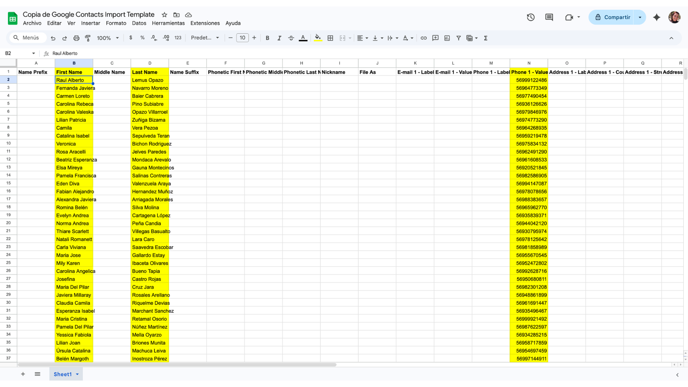
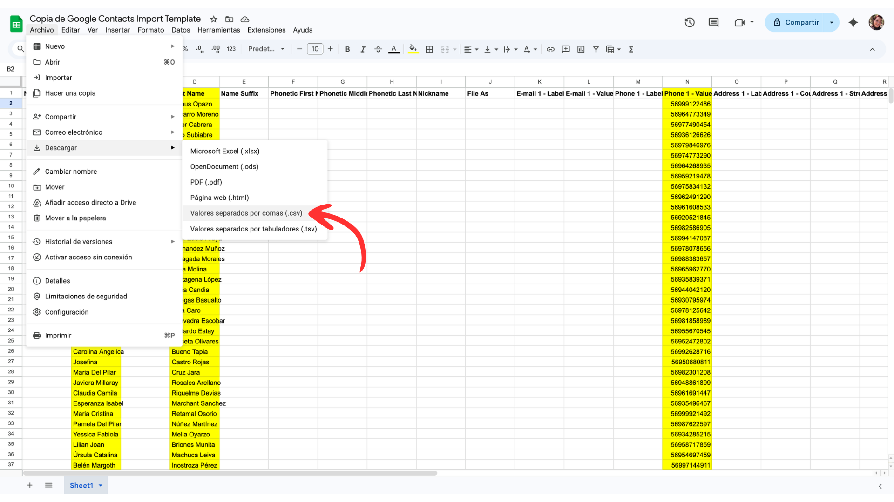

# WhatsApp

WhatsApp es uno de los canales de comunicación directa con los inscritos, especialmente útil para el seguimiento proactivo.

## Cómo agregar contactos masivamente a WhatsApp

Cuando se asignan inscritos para seguimiento proactivo, es probable que necesites agregar muchos números de teléfono a tu WhatsApp de una vez. La forma más eficiente es importarlos a través de Google Contacts, que se sincroniza automáticamente con WhatsApp.

### Paso 1: Completar la plantilla de contactos

1. Abre la [plantilla de importación de contactos](https://docs.google.com/spreadsheets/u/2/d/1trkW9YG7CEDyGm8ptTOIhRRT779qqiGoMRbx6QPbWMM/copy) — se creará una copia en tu Google Drive.
2. Completa las columnas con los datos de tus inscritos asignados. Verifica que **todos los números tengan el prefijo `+56`** (o el código de país que corresponda). Sin el código de país, WhatsApp no podrá identificar el contacto.

### Paso 2: Descargar como CSV

1. En la plantilla completada, ve a **Archivo → Descargar → Valores separados por comas (.csv)**.

### Paso 3: Importar a Google Contacts

1. Abre [Google Contacts](https://contacts.google.com) en tu computador, con la **misma cuenta de Google** que usas en tu celular.
2. En el menú lateral izquierdo, haz clic en **"Importar"**.
3. Selecciona el archivo CSV que descargaste y haz clic en **"Importar"**.
4. Los contactos aparecerán en tu lista de Google Contacts.

### Paso 4: Sincronizar con tu celular

**Android:**

1. Ve a **Ajustes → Cuentas → Google → tu cuenta**.
2. Activa la sincronización de **Contactos** (si no está activa).
3. Toca **"Sincronizar ahora"** para forzar la sincronización inmediata.

**iPhone:**

1. Ve a **Ajustes → Contactos → Cuentas → Gmail/Google**.
2. Activa **Contactos**.
3. Los contactos se sincronizarán automáticamente.

### Paso 5: Actualizar contactos en WhatsApp

1. Abre WhatsApp.
2. Ve a **Nueva conversación** (ícono de chat nuevo).
3. Si los contactos no aparecen, toca los tres puntos (⋮) → **"Actualizar"** (Android) o desliza hacia abajo la lista de contactos (iPhone).
4. Los contactos importados que tengan WhatsApp aparecerán disponibles.

!!! warning "Importante"
    Solo aparecerán en WhatsApp los contactos que tengan la app instalada y registrada con ese número de teléfono. Si un inscrito no aparece, puede que no use WhatsApp o que esté registrado con otro número.

!!! tip "Consejo"
    Si vas a importar contactos de varias convocatorias, puedes agregarles un prefijo al nombre para identificarlos fácilmente (ej: `[SLEP] María José Pérez`). Esto también facilita buscarlos después en WhatsApp.
